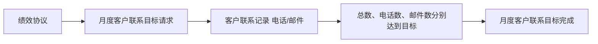

# CRM 电话销售绩效协议：合同、履约与边界

## 合同边界

| 合同             | 双方                 | 履约             |
| ---------------- | -------------------- | ---------------- |
| 电话销售绩效协议 | 绩效管理者、电话销售 | 月度客户联系目标 |

绩效协议是内部权责约定，不要求存在对外合同。用户主体（`party.user`）可以分别扮演绩效管理者（`role.performance-manager`）或电话销售（`role.tele-sales`）；这两条类型关系不证明同一协议实例由同一自然人同时承担双方。客户档案（`thing.customer-profile`）属于独立领域上下文，不是协议一方；拨号器、页面、数据库和同步回调均未进入业务模型。

管理者通过月度客户联系目标请求（`request.monthly-customer-contact`）约定业务周期及联系总数、电话数和邮件数。电话销售每次实际联系形成客户联系记录（`confirmation.customer-contact-record`），记录指向客户档案并注明渠道。三项目标分别达到才完成履约，合成场景中的 3／2／1 不是固定业务指标。

周度进度检查虽然是来源中的候选履约，但检查记录责任方尚未明确；目标设定流程的权利方与义务方、未达标后果和客户档案生命周期也未明确。本批次不为这些缺口补造规则，详见 [CRM 建模评估](crm-assessment.md)。

## 请求与结果

| 履约             | 请求方 → 义务方       | 完成依据                     | 截止                |
| ---------------- | --------------------- | ---------------------------- | ------------------- |
| 月度客户联系目标 | 绩效管理者 → 电话销售 | 目标周期内的客户联系记录集合 | 请求的 `expired_at` |

请求和证明各有实际责任方，不插入通用审批步骤。请求区间使用 `started_at`、`expired_at`；绩效协议用 `signed_at`，客户联系记录用 `confirmed_at`。

## 完成判断

客户联系记录通过 `customer_profile_id` 指向客户档案；记录只有在所属请求、协议与业务周期全部匹配，`confirmed_at` 落在请求区间内且渠道为电话或邮件时才计入。三项目标分别达到才判定完成。

## 时间与边界

- 恰在 `expired_at` 时刻确认的联系仍在目标周期内；周期外的记录不计入任何一项计数。
- 联系渠道当前只识别来源明确的电话 `phone` 和邮件 `email` 两种取值。
- 未达标只表示完成条件不成立；来源没有说明未达标是否构成违约、处分或补偿，因此不判定 breached。
- 客户档案当前只提供稳定档案身份，不展开生命周期、读取、维护或去重规则。
