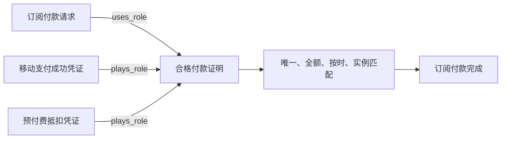
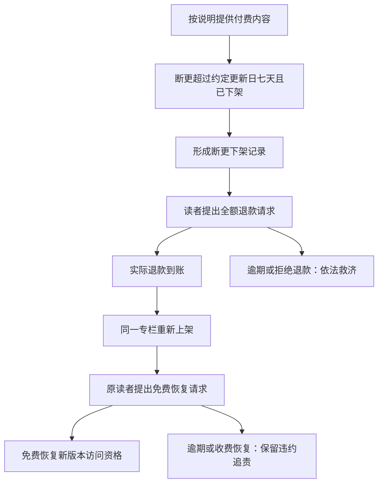

# 专栏订阅与 CRM 电话销售：合同、履约与变化点

## 合同边界

| 合同       | 双方                   | 履约                                         |
| ---------- | ---------------------- | -------------------------------------------- |
| 专栏订阅   | 读者、专栏运营方       | 订阅费支付、付费内容访问、断更退款、免费恢复 |
| 移动支付   | 支付用户、支付机构     | 移动支付扣款                                 |
| 预付费账户 | 账户使用方、账户服务方 | 账户余额抵扣                                 |

同一用户（`party.user`）在三份合同中保持主体身份，分别扮演读者（`role.reader`）、支付用户（`role.mobile-user`）和账户使用方（`role.account-user`）。读者是订阅上下文中的角色，不是跨上下文的主体类型。专栏运营企业同时承担订阅合同的运营方角色和账户合同的服务方角色，但两个合同的资金责任分别记录。当前模型不展开该企业及移动支付机构的 Party 节点和扮演关系，仅保留相应合同角色；这不改变上述业务身份说明及责任归属。

## CRM 电话销售边界

| 边界             | 双方或根对象         | 当前纳入职责             |
| ---------------- | -------------------- | ------------------------ |
| 电话销售绩效协议 | 绩效管理者、电话销售 | 月度客户联系目标         |
| 客户信息领域     | 客户档案             | 为联系记录提供业务标的物 |

绩效协议是内部权责约定，不要求存在对外合同。用户主体（`party.user`）可以分别扮演绩效管理者（`role.performance-manager`）或电话销售（`role.tele-sales`）；这两条类型关系不证明同一协议实例由同一自然人同时承担双方。客户档案（`thing.customer-profile`）属于独立领域上下文，不是协议一方；拨号器、页面、数据库和同步回调均未进入业务模型。

管理者通过月度客户联系目标请求（`request.monthly-customer-contact`）约定业务周期及联系总数、电话数和邮件数。电话销售每次实际联系形成客户联系记录（`confirmation.customer-contact-record`），记录指向客户档案并注明渠道。三项目标分别达到才完成履约，合成场景中的 3／2／1 不是固定业务指标。

周度进度检查虽然是来源中的候选履约，但检查记录责任方尚未明确；目标设定流程的权利方与义务方、未达标后果和客户档案生命周期也未明确。本批次不为这些缺口补造规则，详见 [CRM 建模评估](crm-assessment.md)。

## 请求与结果

| 履约       | 请求方 → 义务方         | 完成证明                           | 截止               |
| ---------- | ----------------------- | ---------------------------------- | ------------------ |
| 订阅费支付 | 平台 → 读者             | 合格付款证明角色的具体玩家         | 签约后 15 分钟     |
| 内容访问   | 读者 → 平台             | 指定读者、章节和版本的内容提供凭证 | 本次请求后 60 秒   |
| 断更退款   | 读者 → 平台             | 原资金渠道已到账的全额退款凭证     | 本次请求后 7 天    |
| 免费恢复   | 原读者 → 平台           | 指定新版本已恢复、实收为零的凭证   | 本次请求后 24 小时 |
| 移动扣款   | 支付用户 → 支付机构     | 支付机构扣款成功凭证               | 不超过订阅付款截止 |
| 余额抵扣   | 账户使用方 → 账户服务方 | 实际扣减和扣后余额凭证             | 不超过订阅付款截止 |

请求和证明各有实际责任方，不插入通用审批步骤。请求区间使用 `started_at`、`expired_at`；合同用 `signed_at`，完成证明用 `confirmed_at`，补充记录用 `created_at`。断更下架记录与重新上架记录由订阅合同形成并管理，直接属于订阅合同上下文；它们通过证明与先后关系服务退款、恢复履约，不成为对应 Fulfillment 的直属凭证。

## 付款变化点

`role.payment-proof` 没有自己的签发人、时间或凭证实例。付款规则只绑定这个证明约定；实际资金结果仍属于移动支付或账户合同。新增支付方式通过新的具体凭证和扮演关系接入，不复制订阅付款履约。

## 断更后的责任链

断更下架记录必须先于退款请求存在，重新上架记录必须先于恢复请求存在。退款和恢复是新的履约，不改写先前支付、访问或违约记录。一份原订阅可经历多次重新上架并分别提出恢复请求，但同一次重新上架活动至多形成一份有效恢复请求。

## 时间与边界

- 恰在付款截止时刻完成扣款仍有效；恰在截止但没有证明仍为待定；超过截止而无合格证明才判定失效。
- 未付款关闭不新增履约，没有额外赔偿或罚款。
- 扣款业务时间与通知到达时间分离，迟到扣款不能恢复失效合同。
- 退款晚到账保留逾期事实，不把完成时刻倒填到截止前。
- 退款后拒绝新的旧版内容检索，但先前已完成的内容提供仍保持完成；查询资格与历史履约状态分开计算。
- 免费恢复以同一专栏的新版本为标的，不制造新的付款义务。

## 可执行场景

| 分组           | 场景                                                                 |
| -------------- | -------------------------------------------------------------------- |
| 正常           | 移动支付后访问、余额抵扣后访问、断更全额退款、重新上架免费恢复并访问 |
| 付款边界       | 截止前待定、恰到截止待定、超过截止失效、恰到截止付款、晚一秒付款     |
| 错配与不足     | 少付一元、错配读者、账户余额不足                                     |
| 违约与补偿     | 内容提供超时、退款超时、退款晚到账、恢复超时、恢复额外收费           |
| 当前资格       | 退款后旧版检索被拒绝，历史提供凭证不改写                             |
| CRM 正常与不足 | 月度总数、电话数、邮件数均达标；总数和电话数不足时不完成             |

以上场景均以固定 `asOf` 执行。没有确认凭证时使用显式空集合，不构造占位确认。CRM 不足场景只判定完成条件为假；由于来源未给出未达标责任，不判定违约。
