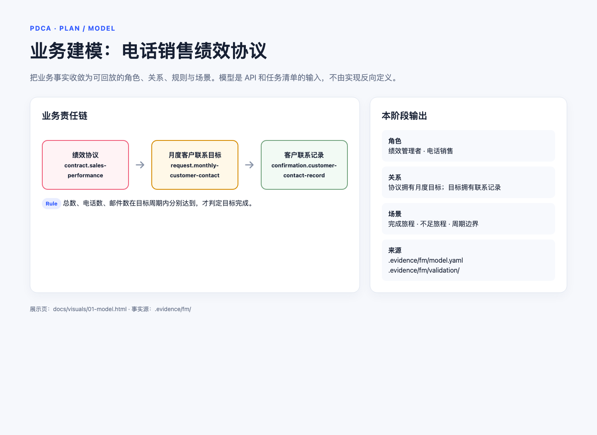
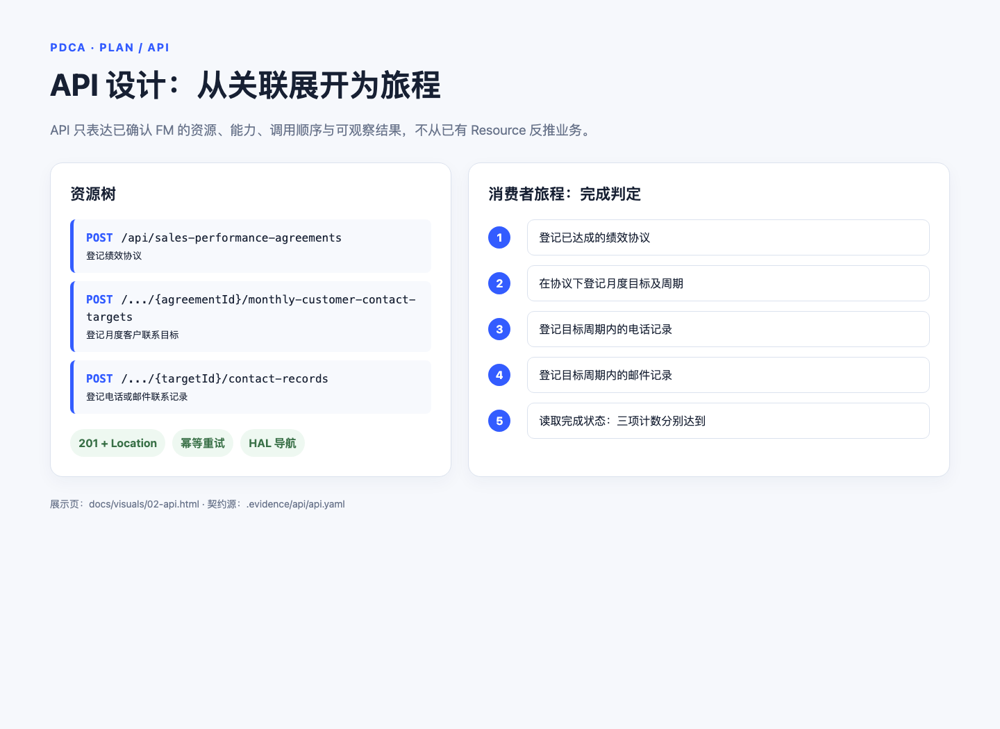
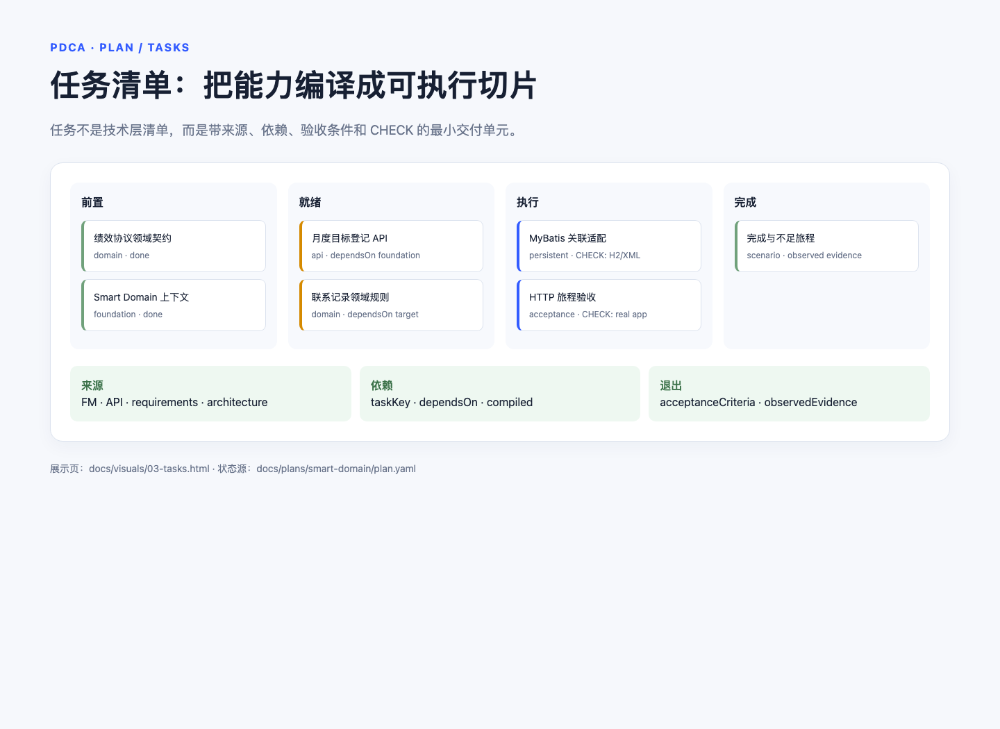
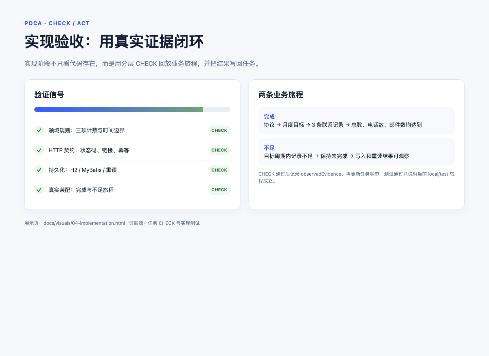
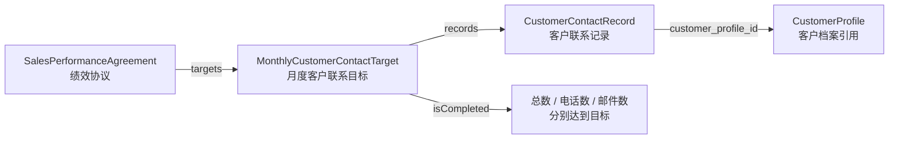

# Evidence：以可追溯前馈驱动双层交付循环

Evidence 是 Nx 单仓库中的业务建模与交付 Harness，配有 React/TypeScript 前端和 Spring Boot/Java 后端。它把业务来源、实现依据、任务状态与真实检查结果保存在仓库中，使新会话能恢复同一项工作。

## 业务背景

当前建模的业务是 CRM 电话销售绩效协议：绩效管理者与电话销售就一个业务周期内的客户联系目标形成内部权责约定。管理者提出带周期及联系总数、电话数、邮件数的月度目标请求；电话销售每次实际联系形成客户联系记录，记录指向独立客户信息领域中的客户档案并注明渠道；三项目标分别达到才完成履约，未达标只表示完成条件不成立。

以上是导读，不是规则全集：业务事实以 [FM 概览](.evidence/fm/00-overview.md)为准。仓库同时承载该业务的建模、接口设计与交付流程，以及独立于该业务的本地用户基础切片。

## 从这里开始

- Agent：[项目宪法](AGENTS.md) → [Guides 导航与开工检查](docs/guides/index.md)。
- 理解产品：[业务模型](.evidence/fm/00-overview.md) → [API 设计](.evidence/api/README.md) → [软件范围](docs/requirements/scope.md)。
- 理解实现：[架构基线](docs/architecture/overview.md) → [模块边界](docs/architecture/modules.md) → [领域映射](docs/architecture/domain-mapping.md)。
- 运行工程：[本地开发](docs/howtos/local-development.md)、[数据库](docs/howtos/database.md)、[浏览器调试](docs/howtos/browser-debugging.md)。
- 使用工作流：[建模指南](docs/evidence-modeling.md)、[Skills 索引](.agents/skills/README.md)。

## 前馈结构

```text
项目宪法                 AGENTS.md：权限、不变量、阅读入口
    ↓
项目基线                 范围、FM/API、架构、术语、质量属性
    ↓ 按当前任务选择
工程指南                 规范、howtos、真实源码与测试范例
    ↓
任务 Guides              来源、局部设计、文件边界、CHECK、停止条件
```

[Guides 导航](docs/guides/index.md) 是项目级阅读路由，不保存另一份模型、任务图或执行状态。任务文件消费来源而不复制来源；生成报告不能覆盖源文件；现有代码也不能反向定义期望业务。

## PDCA 交付主轴：建模 → API → 任务清单 → 实现

README 的主线不是按目录介绍代码，而是展示一次业务能力如何在 PDCA 中逐步变成可验证的软件交付。当前绩效协议沿四个阶段推进：每个阶段都有输入、产物、检查点和截图；阶段结束后才把结果交给下一阶段。

```text
Plan  建模
  ↓ 业务事实、角色、关系、规则、场景
Plan  API
  ↓ 资源、能力、绑定、表示、消费者旅程
Plan  任务清单
  ↓ 软件职责、依赖、验收条件、CHECK
Do    实现
  ↓ 领域、持久化、HTTP、真实装配
Check → Act：回放旅程、记录证据、局部修复或回到上一个阶段
```

| 阶段         | 输入 → 产物                                                                                      | PDCA 检查点                                                                                | 截图                                                    |
| ------------ | ------------------------------------------------------------------------------------------------ | ------------------------------------------------------------------------------------------ | ------------------------------------------------------- |
| **建模**     | 业务材料 → `.evidence/fm/` 中的 FM、正式术语、关系、规则和验证场景。                             | 业务链能被回放；协议、月度目标、联系记录和完成判断的含义明确。                             |           |
| **API**      | FM → `.evidence/api/api.yaml` 中的资源、能力、调用者绑定、表示、错误和消费者旅程。               | 每项能力能追溯到 FM；HTTP 结果、幂等、导航和参与方边界可观察。                             |              |
| **任务清单** | API、范围、架构和测试工序 → `plan.yaml` 的切片、`taskKey`、依赖、任务 Guides、验收条件和 CHECK。 | 任务可编译、依赖可排序、每个验收条件都有具体检查，不把 FM 自动变成全套 CRUD。              |           |
| **实现**     | 就绪任务 → 领域对象、关联适配器、Jersey 子资源、MyBatis XML、真实装配测试和 `observedEvidence`。 | 完成与不足旅程均可回放；区分领域、HTTP、持久化和应用层证据，再决定修复、重规划或完成任务。 |  |

### 四阶段截图

每张图都是阶段结果的离线截图；图片负责在 README 中快速浏览，但不是业务事实源。模型、API、任务状态和验收结果仍分别以 `.evidence/fm/`、`.evidence/api/api.yaml`、`plan.yaml` 和任务 CHECK 为准。

#### 1. 建模：业务事实与规则


#### 2. API：资源树与消费者旅程


#### 3. 任务清单：从能力到可执行切片


#### 4. 实现：分层检查与真实验收


当前绩效协议的具体链路是：只有当“协议 → 月度目标 → 联系记录 → 三项目标完成规则”在建模阶段成立，API 才能设计对应接口；只有 API 和软件范围收敛后，才能编译任务清单；只有任务就绪后，才进入实现。规则变化时回到建模，契约变化时回到 API，切片或依赖变化时回到任务清单，而不是在实现层打补丁。

## 领域模型与 Smart Domain 关联

Accounting README 的重点不是把所有代码列出来，而是先说明“谁拥有谁、行为在哪里发生、关联如何被访问”。当前项目可以用同样的方式阅读：绩效协议拥有月度目标，月度目标拥有客户联系记录；客户档案只是独立上下文中的引用，不被复制成协议模块的 CRUD。



领域对象用公开的窄接口提供读取，用对象内部的宽接口执行追加，从而让归属校验留在行为拥有者中，而不是散落在 Resource 或 Mapper：

```java
public final class SalesPerformanceAgreement {
    public HasMany<String, MonthlyCustomerContactTarget> targets() {
        return targets;
    }

    public MonthlyCustomerContactTarget proposeTarget(
            MonthlyCustomerContactTargetDescription description) {
        if (!identity.equals(description.agreementId())) {
            throw new IllegalArgumentException("Target does not belong to agreement");
        }
        return targets.add(this, description);
    }

    public interface Targets extends HasMany<String, MonthlyCustomerContactTarget> {
        MonthlyCustomerContactTarget add(
                SalesPerformanceAgreement agreement,
                MonthlyCustomerContactTargetDescription description);
    }
}
```

这段代码展示的是本项目的结构性原则，不是新的业务事实：`proposeTarget` 负责协议归属，`MonthlyCustomerContactTarget.registerContactRecord` 负责目标、协议和周期的一致性，`isCompleted` 负责三项计数规则。具体字段和异常契约仍以 FM、API 设计及源码为准。

## 从领域关联到 HTTP 子资源

根关联由 Jersey 根资源暴露，实体关联继续作为子资源展开。当前 local/test API 的可观察路径是：

```text
GET  /api/
POST /api/sales-performance-agreements
GET  /api/sales-performance-agreements/{agreementId}
POST /api/sales-performance-agreements/{agreementId}/monthly-customer-contact-targets
GET  /api/sales-performance-agreements/{agreementId}/monthly-customer-contact-targets/{targetId}
POST /api/sales-performance-agreements/{agreementId}/monthly-customer-contact-targets/{targetId}/contact-records
```

对应的资源装配保持简单：根资源注入 `SalesPerformanceAgreements`，协议资源只负责返回目标集合子资源，目标资源再返回联系记录子资源。HTTP 层负责请求解析、表示、状态码和链接；它不重新实现“记录是否计入目标”或“是否完成”的规则。

```java
@Path("sales-performance-agreements")
public SalesPerformanceAgreementsApi salesPerformanceAgreements() {
    return resourceContext.initResource(
            new SalesPerformanceAgreementsApi(agreements, idempotencyLedger));
}

@Path("monthly-customer-contact-targets")
public MonthlyCustomerContactTargetsApi targets() {
    return resourceContext.initResource(
            new MonthlyCustomerContactTargetsApi(agreement, idempotencyLedger));
}
```

完整请求字段、参与方绑定、`201`/`403`/`409`/`422`、幂等键与 HAL 表示以 [API 设计源](.evidence/api/api.yaml)为准；README 中的路径只是帮助读者建立导航，不是第二份 HTTP 契约。

## 关联生命周期：概念归属不等于加载策略

这里应借鉴 Accounting README 对 lifecycle 的区分，但结合当前实现准确描述：

| 关联                | 概念归属       | 当前 local/test 实现                 | 说明                                             |
| ------------------- | -------------- | ------------------------------------ | ------------------------------------------------ |
| 绩效协议 → 月度目标 | 协议拥有目标   | MyBatis 关联适配器按协议装配目标集合 | `proposeTarget` 校验目标属于当前协议             |
| 月度目标 → 联系记录 | 目标拥有记录   | MyBatis 关联适配器按目标装配记录集合 | `registerContactRecord` 校验协议、请求和周期一致 |
| 联系记录 → 客户档案 | 外部上下文引用 | 只保存 `customer_profile_id`         | 当前不加载、不维护客户档案生命周期               |

“拥有”表达业务行为和 URI 归属；“何时加载”表达技术生命周期，不能把两者混为一谈。当前实现用 H2、Flyway、MyBatis 和领域对象完成 local/test 往返；生产环境的数据库、隔离级别、并发策略和客户档案集成不属于本 README 的实现说明。

## 以一条能力贯穿各层

用 `capability.register-sales-performance-agreement-tele-sales` 阅读实现时，可以按以下顺序定位，而不是从 Controller 反推业务：

1. **FM**：`contract.sales-performance` 定义协议及其与月度目标的关系。
2. **领域**：`SalesPerformanceAgreement` 拥有 `targets`，行为通过 `proposeTarget` 进入。
3. **持久化**：`SalesPerformanceAgreements` 与 MyBatis XML 装配领域对象和关联集合。
4. **HTTP**：`SalesPerformanceAgreementsApi` 将登记请求映射为 `201`、`Location`、幂等和错误响应。
5. **验收**：月度客户联系旅程从真实 HTTP、H2/MyBatis 和领域规则回放完成、不足、边界时间及拒绝后不变。

这条阅读顺序保留了 Accounting 风格的“领域模型先于 API 实现”，同时保留本项目的证据纪律：代码示例解释结构，FM/API/任务 CHECK 才分别决定业务事实、HTTP 契约和本次是否验证通过。

## 双层循环

```text
外层 PDCA：Plan → Do → Check → Act
                  │          ↑
                  │ 一个就绪任务与它的来源
                  ↓          │ 结果、重验范围
内层：         Guides → Action → Sensors → Steer
                  ↑                            │
                  └──── 局部修正后重装前馈 ────┘
```

- **Plan**：从真实业务与软件范围设计切片，编译稳定 taskKey、依赖及覆盖。架构和模块方案约束实现，不替业务决定权限或义务。
- **Do / Guides**：核对工作树、当前来源与直接前置证据；通过开工检查后才开始一个任务。
- **Sensors / Check**：执行任务 CHECK、测试、静态分析与构建；区分结构校验、运行验证和人工业务判断。
- **Steer / Act**：代码错误局部修复；任务设计问题修订详情；切片或依赖变化返回 Plan；业务未知交回来源拥有者。完成当前任务后停止。

### 用“电话销售绩效协议”走一遍 PDCA

下面不是另建一套流程，而是把当前项目的绩效协议上下文作为外层 PDCA 的具体练习。业务事实来自 [绩效协议 FM](.evidence/fm/00-overview.md)，软件范围与非目标来自当前 [smart-domain 计划](docs/plans/smart-domain/plan.yaml)，实现证据以 [月度客户联系旅程测试](apps/backend/src/test/java/com/evidencepoc/backend/salesperformance/MonthlyCustomerContactJourneyTests.java) 为准。

| 阶段      | 在本项目中的实践                                                                                                                                                                                                 | 必须留下的证据                                                                                                                                 | 不能越过的边界                                                                                                               |
| --------- | ---------------------------------------------------------------------------------------------------------------------------------------------------------------------------------------------------------------- | ---------------------------------------------------------------------------------------------------------------------------------------------- | ---------------------------------------------------------------------------------------------------------------------------- |
| **Plan**  | 把“登记绩效协议 → 提出月度客户联系目标 → 登记电话/邮件联系记录 → 判断三项目标是否完成”编译成可交付切片；明确协议、目标请求、联系记录的拥有者、依赖和验收场景。                                                   | `plan.yaml` 的 `slicing`、`compiled`、任务 `taskKey`、`dependsOn`、`acceptanceCriteria`；来源指向 FM/API，而不是聊天记忆。                     | 不把客户档案 CRUD、生产身份、生产数据库、周度检查或未达标后果偷偷加入本批次；合成目标值 `3/2/1` 只是验证数据，不是公司指标。 |
| **Do**    | 只选择一个结构上就绪且前置完成的任务。例如先交付绩效协议登记，再按依赖交付月度目标和联系记录；每个任务开始前重新核对角色、协议归属、业务周期、文件范围和非目标。                                                 | 任务进入 `in-progress` 的状态变化、实际改动文件，以及 Guides 开工检查对来源、前置、设计、环境和退出条件的核对。                                | “电话销售”或“绩效管理者”的角色扮演不自动等于认证或跨协议访问权；登记接口也不替代双方已经达成协议这一业务事实。               |
| **Check** | 用完成与不足两条旅程检查：目标周期内 `phone`/`email` 记录是否按 `agreement_id`、`request_id`、`period_id` 和时间窗口计入；总数、电话数、邮件数是否分别达到目标；`expired_at` 时刻是否包含，周期外是否排除。      | 任务 CHECK 的精确命令、退出码、日志指针、断言和 `observedEvidence`；当前旅程测试已覆盖三项目标完成、不足时保持 pending、边界时间和写入后重读。 | 领域测试不能证明 HTTP/SQL，HTTP 测试不能证明真实持久化；构建成功、文件存在或旧缓存命中也不能单独证明履约完成。               |
| **Act**   | 根据信号做最小转向：代码错误留在当前任务修复；协议映射或任务设计错误修订任务；切片/依赖变化回到 Plan 重编译；业务事实不清交回 FM/发现记录拥有者。满足验收后先写 `observedEvidence`，再将任务置为 `done` 并停止。 | `plan.yaml` 的状态、真实检查结果和验证记录；必要时重新生成 `review.html`，但不让审核页反向改状态。                                             | “未达标”只表示完成条件不成立，当前来源没有授权把它解释为违约、处分或补偿，也不能通过删失败测试或放宽场景取得通过。           |

这段实践的关键是把“绩效”从一个泛化的业务名词收敛为可审计的上下文链：**一份已达成的协议 → 某协议下的月度目标 → 目标周期内、正确客户档案和渠道的联系凭证 → 三项计数规则的结果**。内层 `Guides → Action → Sensors → Steer` 负责当前任务做对；外层 PDCA 负责决定是否继续、修复、阻塞或重规划，两者都只通过仓库中的计划、来源和真实检查结果交换信息。

### 一次交付的 PDCA 操作剧本

每次恢复或开始交付时，都把“绩效协议上下文”翻译成下面四个可执行问题；不要只记录“完成了绩效功能”这一类没有边界的结论。

1. **Plan：先定义本轮要证明的业务结果。** 从 `plan.yaml` 选择一个就绪任务，沿 `agreement_id → request_id → period_id → customer_profile_id` 核对来源和依赖。例如，本轮若交付联系记录，就必须先确认协议与月度目标任务已完成；验收目标应明确为“目标周期内的 `phone`/`email` 记录分别计数”，而不是笼统地写“支持绩效统计”。
2. **Do：只实现该任务承诺的最小闭环。** 按任务 Guides 装配来源、架构和范例，修改领域拥有者及其适配层；例如由目标拥有者决定联系记录是否计入，由 MyBatis 适配器负责读写，而不是在 Resource 中重新计算。合成的 `3/2/1` 仅用于回放完成场景，不能在实现中固化为公司绩效指标；身份认证、客户档案维护和未达标处置不属于本轮实现。
3. **Check：同时检查业务结果和工程边界。** 至少回放一条完成旅程和一条不足旅程：同一协议、目标和周期下，目标内记录按总数、电话数、邮件数分别计数；`expired_at` 时刻计入，周期外排除；不足时保持未完成且拒绝写入不改变已有事实。再按任务 CHECK 的层级核对证据：领域测试证明规则，HTTP 测试证明契约，H2/MyBatis 或真实装配测试证明持久化链；不能用其中一层替代另一层。
4. **Act：按信号类型决定下一步，而不是把所有失败都当成代码问题。** 代码断言失败就在当前任务局部修复并重验；来源映射、验收条件或任务设计不完整就修订任务详情；切片、依赖或软件范围改变就回到 Plan 重编译；业务事实不清就回到发现/FM 拥有者。只有实际 CHECK 结果写入 `observedEvidence` 后，才更新 `tasks[taskKey].status`；完成一个获授权任务即停止，不顺手推进下一任务。

可以用下面的转向表快速判断“下一步回到哪里”：

| 观察到的信号                                  | PDCA 决策                         | 绩效协议中的例子                                     |
| --------------------------------------------- | --------------------------------- | ---------------------------------------------------- |
| 计数规则或周期边界断言失败                    | 留在当前 Do，修复后重跑 Check     | `expired_at` 的记录被排除，或 `email` 被算入 `phone` |
| HTTP 返回正确但重读没有事实，或拒绝后数据改变 | 留在当前任务，检查领域/持久化边界 | 非法 `customer_profile_id` 仍写入联系记录            |
| 需要新增客户档案 CRUD、周度检查或未达标处分   | 回到 Plan，重新确认范围和依赖     | 不能因为“绩效”一词就扩展成完整 CRM 或人事处置流程    |

本剧本与上表的分工是：上表说明外层 PDCA 在当前业务里的目标和证据；本剧本说明一次具体交付如何从计划进入实现、如何采集信号、如何转向。它们共同防止把“未达标”误写成“违约”，也防止把测试通过误写成“生产绩效协议已经成立”。

## 一条能力走读：登记电话销售绩效协议

以 `capability.register-sales-performance-agreement-tele-sales` 为例，一条业务能力穿过来源与实现的各层，每层只负责自己的判断：

| 层       | 位置                                                                                                                                                                                                                                                                    | 这一层负责什么                                                                |
| -------- | ----------------------------------------------------------------------------------------------------------------------------------------------------------------------------------------------------------------------------------------------------------------------- | ----------------------------------------------------------------------------- |
| 业务事实 | [contract.json](.evidence/fm/contexts/sales-performance/contract.json)                                                                                                                                                                                                  | 协议凭证的编号与达成时刻，以及“协议先于月度目标请求”的关系                    |
| API 设计 | [api.yaml](.evidence/api/api.yaml) 的 `capability.register-sales-performance-agreement-tele-sales`                                                                                                                                                                      | 调用者绑定、请求字段、`201`/`403`/`409`/`422` 与 `Idempotency-Key` 的幂等语义 |
| 领域     | [SalesPerformanceAgreement.java](libs/backend/domain/src/main/java/com/evidencepoc/backend/domain/model/SalesPerformanceAgreement.java)                                                                                                                                 | 拥有协议身份、描述与所属目标集合；`proposeTarget` 校验目标归属                |
| 持久化   | [SalesPerformanceAgreements.java](libs/backend/persistent/src/main/java/com/evidencepoc/backend/persistent/associations/SalesPerformanceAgreements.java)、[Mapper XML](libs/backend/persistent/src/main/resources/mybatis.mappers/SalesPerformanceAgreementsMapper.xml) | 装配领域图、写入与唯一约束、幂等台账回放                                      |
| HTTP     | [SalesPerformanceAgreementsApi.java](libs/backend/api/src/main/java/com/evidencepoc/backend/api/SalesPerformanceAgreementsApi.java)                                                                                                                                     | Jersey 子资源入口、请求解析、`201` 与 `Location`、异常映射                    |
| 证据     | [MonthlyCustomerContactJourneyTests.java](apps/backend/src/test/java/com/evidencepoc/backend/salesperformance/MonthlyCustomerContactJourneyTests.java)                                                                                                                  | 真实 HTTP 与 H2/MyBatis 走完完成、不足两条旅程，覆盖周期边界与拒绝后数据不变  |

从 [api.yaml](.evidence/api/api.yaml) 摘录的可观察契约（权威在那里，此处只作导读）：

```text
POST /api/sales-performance-agreements
Idempotency-Key: <同一次登记的重试沿用同一键>
{ "agreement_id": "PERF-2026-Q4-001", "signed_at": "2026-09-25T09:00:00Z" }

201 + Location + 自链接 + Cache-Control: no-store
调用者不是本协议的电话销售参与方 → 403
同一键不同输入，或该协议凭证已存在 → 409；协议编号或达成时刻无效 → 422
```

这条链同时是验证边界：领域测试不证明 HTTP/SQL，HTTP 测试不证明真实持久化，命令成功与文件存在不证明履约完成；分层命令与证据规则见[测试指南](docs/engineering/testing.md)。

## 代码模块地图

| 位置                      | 内容               | 说明                                                            |
| ------------------------- | ------------------ | --------------------------------------------------------------- |
| `apps/backend`            | Spring Boot 组合根 | 启动配置、Jersey 挂载、跨模块装配与真实装配测试                 |
| `apps/frontend`           | React 前端         | 当前是导航页，不是完整业务 UI                                   |
| `libs/backend/domain`     | 领域               | 实体、Description、Context 接口与角色对象；业务行为的唯一拥有者 |
| `libs/backend/api`        | HTTP               | Jersey 根资源与子资源、请求与表示、错误映射；只做协议映射       |
| `libs/backend/persistent` | 持久化             | smart-domain 适配器、MyBatis XML、Flyway 迁移                   |
| `.agents/skills`          | 工作流 Skill       | 建模、需求、API、规划、交付的方法与回归                         |
| `tools/guides`            | 前馈检查器         | `guides:verify` 的扫描范围与链接检查实现                        |

模块边界、允许依赖与禁止访问见[模块设计](docs/architecture/modules.md)与[架构基线](docs/architecture/overview.md)；每层的测试边界与命令见[测试指南](docs/engineering/testing.md)。仓库中的代码多于当前 FM 描述的业务，存在不等于软件范围已批准。

## 仓库中的唯一职责

| 位置                                  | 职责                                                                   |
| ------------------------------------- | ---------------------------------------------------------------------- |
| `.evidence/discovery.json`            | 业务材料、回答与控制状态                                               |
| `.evidence/fm/`                       | 当前 FM、正式业务术语、规则与回放场景                                  |
| `.evidence/api/api.yaml`              | 当前 API 设计源                                                        |
| `docs/requirements/`                  | 软件职责、故事验收与质量属性                                           |
| `docs/architecture/`                  | 项目技术基线、模块/数据边界与领域映射                                  |
| `docs/engineering/`、`docs/howtos/`   | 按工作类型加载的规范、范例与操作说明                                   |
| `docs/plans/smart-domain/plan.yaml`   | 机器可读的 slicing、compiled、任务 Guides/设计、状态、CHECK 与验证记录 |
| `docs/plans/smart-domain/review.html` | 从 plan.yaml 重建的离线只读审核投影                                    |
| `.evidence/checks/`                   | 获授权留存的紧凑运行清单与日志指针                                     |

计划路径是工作流输出约定，不表示仓库已经有可执行计划。没有有效 `plan.yaml` 时先规划，不根据代码存在、审核页或聊天记忆跳到实施。

## 当前范围与边界

[FM 源](.evidence/fm/model.json) 不保存审核状态；业务确认依据由发现记录与需求/计划记录承载。当前 FM 与 API 描述的是电话销售绩效协议及其客户信息依赖，不等于已上线业务系统。

现有 [用户基础切片](apps/backend/README.md) 只提供本地用户 ID 与显示名称接口；前端是导航页，不是完整业务 UI。生产身份权限与生产数据库尚需依据。

软件职责与验收的来源是 [范围](docs/requirements/scope.md) 与 [故事](docs/requirements/stories.md)。已有实现可以作为候选工程范例，但必须在当前工作树重跑相关测试后再复用其证据。

## 操作入口

在仓库根执行，环境准备见 [本地开发](docs/howtos/local-development.md)：

```bash
npm ci
npm run dev
```

本地 HTTP 请求示例（含 `curl` 与分页说明）见[用户切片说明](apps/backend/README.md)。

按目标显式进入工作流，不自动跨阶段：

```text
/evidence-model 讨论业务并保存发现记录
/evidence-model 根据充分材料修改当前 FM 并校验
用 evidence-requirements 明确软件职责与验收
用 evidence-api-design 根据已确认 FM 设计 API
用 evidence-task-planning 根据当前来源生成实施计划
用 evidence-delivery 检查前馈就绪情况并执行一个任务
```

质量入口见 [测试指南](docs/engineering/testing.md)：

```bash
npm run guides:verify
npm test
npm run lint
npm run build
./gradlew check
```

结构自洽、文件写入和命令成功不能替代业务批准。失败应带着真实证据回到正确层次，而不是被改写成完成。

## 实践总结

项目实践总结保存在 [docs/adoption/](docs/adoption/)：

- [需求模糊：Agent 不知道“好”长什么样](<docs/adoption/需求模糊：Agent 不知道“好”长什么样.md>)
- [隐式约定：规则只存在于人的脑子里](docs/adoption/隐式约定：规则只存在于人的脑子里.md)
- [信息散落：知识来源不唯一且更新不及时](docs/adoption/信息散落：知识来源不唯一且更新不及时.md)
- [虚假胜利：Agent 以为自己做完了，其实没有](<docs/adoption/虚假胜利：Agent 以为自己做完了，其实没有.md>)
- [指令文件腐化：AGENTS.md 越来越长，Agent 反而变笨了](<docs/adoption/指令文件腐化：AGENTS.md 越来越长，Agent 反而变笨了.md>)
- [前馈痴迷：Agent 做完就交，从来没人检查](<docs/adoption/前馈痴迷：Agent 做完就交，从来没人检查.md>)
- [反馈过载：Sensors 太多，Agent 不知道哪个信号重要？](<docs/adoption/反馈过载：Sensors 太多，Agent 不知道哪个信号重要？.md>)

这七篇有面向外部读者的改写版本，发布在数字花园：[Agent 交付的七个坏味道](https://www.jayclock-garden.top/knowledge/outputs/agent-%E4%BA%A4%E4%BB%98%E7%9A%84%E4%B8%83%E4%B8%AA%E5%9D%8F%E5%91%B3%E9%81%93)。

## 许可

本项目以 [MIT License](LICENSE) 开源。使用、修改、分发和商用请保留版权与许可声明。
