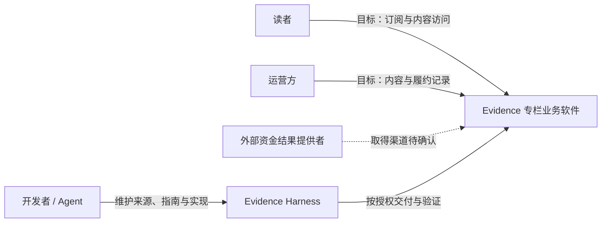
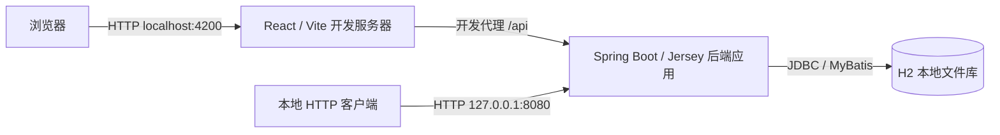

# 架构基线

## 技术决定与来源

后端固定采用 **模块化单体**：一个后端应用统一构建、发布，应用实例内部通过 Java 公开契约协作；可以运行多个应用副本，但不为 FM Context 自动建立独立服务。

依据是 [规划 profile](../../.agents/skills/evidence-task-planning/references/design-rules.md)、[根构建](../../build.gradle)与 [模块配置](../../settings.gradle)。业务模块、技术库、部署容器分别建模；同进程或同库不自动形成一个大事务。

| 方面         | 当前基线                                   | 配置来源                                                        |
| ------------ | ------------------------------------------ | --------------------------------------------------------------- |
| 工作区       | Nx；React/TypeScript 前端与 Java 后端分离  | [package.json](../../package.json)、[nx.json](../../nx.json)    |
| 后端运行时   | Java 17、Spring Boot 3.5.9                 | [build.gradle](../../build.gradle)                              |
| smart-domain | BOM/Core、MyBatis 与 API 官方集成；0.3.0   | [gradle.properties](../../gradle.properties)、模块 build.gradle |
| 持久化       | MyBatis XML 直接装配领域对象、Flyway 迁移  | [persistent 模块](../../libs/backend/persistent/)               |
| HTTP         | Jersey 子资源、HAL/HAL-FORMS               | [api 模块](../../libs/backend/api/)                             |
| 数据库       | 本地 H2 文件库、测试 H2 内存库；生产未选型 | [数据库 howto](../howtos/database.md)                           |

固定上游 commit 与兼容约束由 [上游依据](../../.agents/skills/evidence-task-planning/references/upstream.md)维护。配置是版本定位来源，安装成功不证明集成正确。

## C4：系统上下文

此图表达产品边界及业务联系，不承诺所有业务已实现。资金结果提供者是业务外部参与方，虚线不表示已经选定网络协议。

实际已具备的产品能力见 [范围](../requirements/scope.md)，不能把上下文图当完成清单。FM 中角色存在不代表已经有认证系统或自动开户。

## C4：当前本地容器

这是本地拓扑。Vite 代理不是生产反向代理方案；H2 不是生产选型。`domain/api/persistent` 是同一后端应用中的构建库，不在容器图上画成远程服务。测试使用隔离环境，不连接图中的本地文件库。

## 设计落点

- [模块边界](modules.md)：行为与数据拥有者、公开契约、依赖方向、事务边界。
- [领域映射](domain-mapping.md)：FM 身份/角色/证明/时间如何映射到代码，不复制业务规则。
- [质量属性](../requirements/quality-attributes.md)：生产身份、数据库、审计、多语言和集成缺口。

改变当前技术基线时必须有明确授权，记录决定的来源、理由、影响范围与验证要求；正文同步替换，不能让相互矛盾的有效指南并存。此次基线整理不授予生产设计或业务批准。
