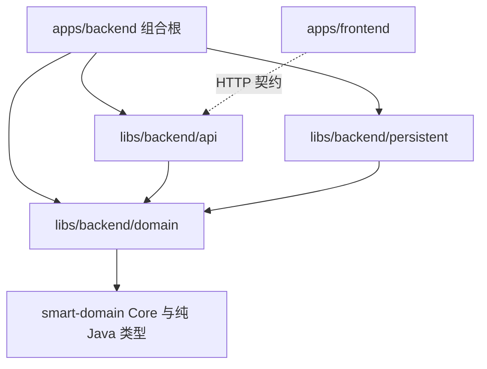
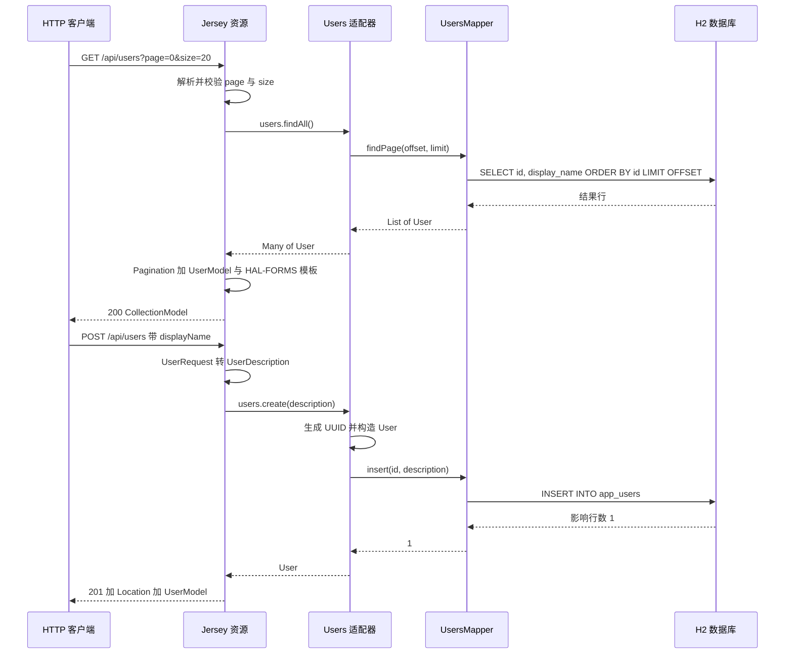

# 后端模块化单体架构

后端固定为**模块化单体**：一个 Spring Boot 应用统一构建、发布，进程内部通过 Java 公开契约协作。`apps/backend` 是组合根，`libs/backend/domain`、`libs/backend/api`、`libs/backend/persistent` 是同一个后端应用里的**技术构建库**，不是业务模块，也不在容器图上画成远程服务。业务模块边界与数据拥有者见 [模块边界](../../docs/architecture/modules.md)，本页只描述技术分层与请求路径。

## 模块与技术库划分

`settings.gradle` 定义真实 Gradle 项目；`build.gradle` 固定 Java 17、Spring Boot 3.5.9 与 `smart-domain` 0.3.0。

| 位置                      | 角色                                              | 允许依赖                         |
| ------------------------- | ------------------------------------------------- | -------------------------------- |
| `apps/backend`            | 组合根、运行配置、Jersey/Jackson 装配、跨模块测试 | domain、api、persistent          |
| `libs/backend/domain`     | 稳定身份、Description、实体/关联行为与领域异常    | smart-domain Core 与纯 Java 类型 |
| `libs/backend/api`        | Root、集合/实体子资源、请求、表示及独立 HTTP 测试 | domain 与 HTTP/表示框架          |
| `libs/backend/persistent` | 关联适配器、Mapper、XML、Flyway 迁移、SQL 测试    | domain 与持久化框架              |

关键约束：`api` 与 `persistent` 互不依赖；`domain` 不反向依赖 Spring、MyBatis、Jackson、Jakarta WS 或 HTTP。组合根只做装配，**不得成为业务 Service**。前端 `apps/frontend` 只消费已约定的 HTTP 契约，不共享 Java 内部对象。



上图是构建依赖方向：组合根聚合三个技术库，api 与 persistent 各自只依赖 domain，二者互不可见；前端只通过 HTTP 契约消费 api。

这些边界由 `BackendArchitectureTests` 的 ArchUnit 规则强制：`domain` 不依赖 api/persistent/config/Spring/MyBatis/Jackson/Jersey；`api` 不触及 persistent/jdbc/ibatis；`persistent` 不触及 api/config/Jersey。

## 组合根装配

`BackendApplication` 是 `@SpringBootApplication` 入口，本身只启动 Spring，不承载业务逻辑。装配集中在 `apps/backend/src/main/java/com/evidencepoc/backend/config/`：

- `JerseyConfiguration extends ResourceConfig`：仅在 `local`/`test` profile 注册 `RootApi` 与三个异常映射器；production profile 不注册用户 CRUD，也不创建其资源 Bean。这由 `UserExposureTests` 固定。
- `JacksonConfiguration`：开启 `FAIL_ON_TRAILING_TOKENS`，并禁止把 Integer/Float/Boolean 隐式强制成文本，配合 `spring.jackson.deserialization.fail-on-unknown-properties=true` 严格拒绝坏 JSON、尾随 JSON 和未知属性。
- `application.properties` 设置 `spring.jersey.application-path=/api`、默认 profile 为 `local`、禁用 H2 Web Console。
- `application-local.properties` 绑定 `127.0.0.1`，使用 H2 文件库；测试 profile 使用 H2 内存库。

`PersistenceConfiguration` 在 persistent 库内通过 `@MapperScan`、`@EnableSmartDomainMybatis` 和 `@PropertySource("classpath:backend-persistence.properties")` 装配 MyBatis 与 smart-domain 官方对象工厂。

## 端到端请求路径

集合列表请求走 `RootApi` → 子资源 `UsersApi` → 领域关联 `Users` → persistent 适配器 → `UsersMapper` → MyBatis XML → H2：



成员路径先定位再进入子资源：`RootApi.users()` 通过 `ResourceContext.initResource` 初始化 `UsersApi`；`UsersApi.findById` 用 `users.findByIdentity(userId)` 定位实体（缺失抛 `UserNotFoundException`），再初始化 `UserApi` 子资源；`UserApi` 的 GET/PUT/DELETE 直接委托 `Users` 的 `update`/`delete`。这是 Jersey 子资源模式，子资源持有已定位实体与必要契约，不跨层编排 Mapper。

## 领域层归属

领域库承载稳定身份与行为，不承担 HTTP 或持久化：

- `Users` 是根集合契约（`HasMany<String, User>`），提供 `create`/`update`/`delete`，定位成员；不是认证授权 API。
- `User` 是无关联叶子 `Entity`，身份字符串稳定，`renameTo` 返回新实例而不改已加载快照。
- `UserDescription` 是 `record` 值对象，校验非 null、非空白、UTF-16 长度 ≤ 100；原样保留不裁剪。
- `InvalidUserDescriptionException`、`UserNotFoundException` 是具名领域异常，由 API 层翻译为 HTTP 状态。

`User` 的私有构造器专供 smart-domain 叶子实体水合，不是公开创建路径；`displayName` 是本地软件字段，不冒充 FM 属性。

## API 层归属

api 库负责协议：解析输入、调用领域、映射错误、构造 HAL 表示。

- `RootApi` 提供 `GET /api/` 的 Root 表示；`RootModel` 暴露 `self` 与 `users` 链接。
- `UsersApi.list` 校验 `page ≥ 0`、`1 ≤ size ≤ 100` 与整数溢出，随后消费 smart-domain `Pagination`，不另建分页算法或集合包装。
- `UsersApi.create` 用 `UserRequest` 把 `displayName` 转成不可变 `UserDescription`，返回 201、Location 与 `UserModel`。
- `UserModel` 直接继承 `RepresentationModel`，用 `Affordances` 提供成员 `update`（default 模板）与 `delete` 模板；集合提供 `create`（default）模板。
- `ApiTemplates` 按资源类/方法生成 URI，`relative` 保留编码与查询串。
- `UserExceptionMappers` 把 `UserNotFoundException`→404 `USER_NOT_FOUND`、`InvalidUserDescriptionException`→400 `INVALID_DISPLAY_NAME`、`BadRequestException`→400 `BAD_REQUEST`。

支持的媒体类型为 `application/json`、`application/hal+json`、`application/prs.hal-forms+json`。HAL 链接相对站点根；Location 可能被 Jersey 规范化为绝对 URI，解析后指向同一资源。

## 持久化层归属

persistent 库是关联适配器与数据拥有者，只依赖 domain 与持久化框架。

- `Users` 适配器实现领域 `Users` 接口：`create` 生成 `UUID.randomUUID()` 身份并检查 `insert` 影响行数；`update` 先定位再 `renameTo`，行数为 0 抛 `UserNotFoundException`；`delete` 同样检查行数。写方法标注 `@Transactional`，参与 Spring 本地事务并可回滚。
- `UserCollection extends EntityList<String, User>` 是惰性分页集合，直接按范围调用 `findPage` 并统计 `count`；它不是 AOP Bean，避免 Spring 代理覆盖框架 final 方法。
- `UsersMapper` 接口 + `UsersMapper.xml` 直接用 resultMap 装配 `User` 与 `UserDescription`，不增加 Row/PO 转换层；SQL 全部参数绑定，分页按 `id` 稳定排序。
- `mybatis-config.xml` 关闭二级缓存并挂载 `InjectableObjectFactory`；`backend-persistence.properties` 指定 mapper-locations 与 config-location。

## 数据与生命周期

```sql
CREATE TABLE app_users (
    id VARCHAR(36) PRIMARY KEY,
    display_name VARCHAR(100) NOT NULL,
    constraint APP_USERS_DISPLAY_NAME_NOT_EMPTY CHECK (
        CHAR_LENGTH(TRIM(display_name)) > 0
    )
);
```

Flyway 首次启动执行 `V1__create_users.sql` 建表，正常重启保留数据；测试使用 `jdbc:h2:mem:users-${random.uuid};DB_CLOSE_DELAY=-1` 的隔离内存库，不连本地文件库。

- 本地 profile 文件库为 `jdbc:h2:file:./.data/users;DB_CLOSE_ON_EXIT=FALSE`，bootRun 工作目录为 `apps/backend`，数据文件通常为 `apps/backend/.data/users.mv.db`。
- 身份服务端生成 UUID，创建后不变；相同显示名称不合并用户。
- PUT 是覆盖写入（最后成功写入者覆盖），不 upsert，不提供乐观版本检查；DELETE 是物理删除，不级联。
- 非法请求为 400，缺失成员为 404，失败不修改数据；H2 文件锁、备份与重置边界见 [数据库 howto](../../docs/howtos/database.md)。

## 运行入口

```bash
# 仓库根；启动后端
npm run dev:backend
# 等价 Gradle 入口
./gradlew :backend:bootRun
```

预期入口：`http://127.0.0.1:8080/api/` 返回含 `users` 关系的 Root 表示；`http://127.0.0.1:8080/actuator/health` 只是基础运行检查，不证明业务已验收。默认 local profile 绑定回环地址，CRUD 只在 local/test 注册，不得通过代理或监听地址变更暴露公网。Nx 侧 `apps/backend/project.json` 让组合根 build/serve 调用根 Wrapper 并声明缓存输入输出与串行约束。

## 分层测试与证据

四个技术层的测试各证其责，不能互相冒充：

| 层         | 命令                                 | 覆盖                                                                           |
| ---------- | ------------------------------------ | ------------------------------------------------------------------------------ |
| domain     | `./gradlew :backend-domain:test`     | 纯领域行为与固定边界；不证明 HTTP/SQL                                          |
| api        | `./gradlew :backend-api:test`        | 真实随机端口 HTTP + mock 领域；不需要数据库，不 mock 被测 Resource/分页/序列化 |
| persistent | `./gradlew :backend-persistent:test` | 真实 H2/MyBatis/XML/Flyway、行数与事务回滚                                     |
| app        | `./gradlew :backend:test`            | 真实 HTTP + SQL、配置、profile 隔离及架构检查                                  |

`BackendApplicationTests` 验证各模块 starter 在组合根真实装配；`MyBatisUsersTests` 验证 SqlSessionFactory、`InjectableObjectFactory`、Flyway 版本 1 与写操作回滚；`UserApiTests` 用 `TestRestTemplate` 走真实 HTTP + SQL 覆盖 CRUD、分页、媒体协商与失败不变性。完整检查入口见 [测试指南](../../docs/engineering/testing.md)。
