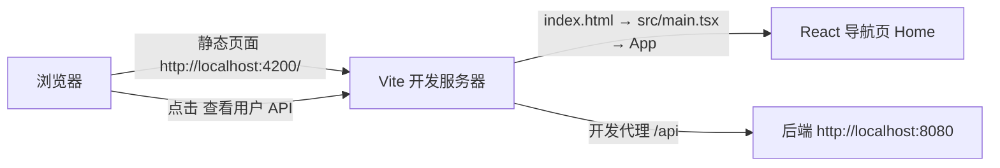

# 前端导航应用架构

前端 `apps/frontend` 是 React 19 + TypeScript + React Router 6 + Vite 构建的**单页导航应用**，当前范围只有一张「用户 API」导航卡片。它不包含订阅流程、用户管理表单、状态库或完整路由体系，也不是这些能力已完成交付的证据。相关实现约束见 [前端工程指南](../../docs/engineering/frontend.md)。

## 入口与启动链路

浏览器首先加载 [index.html](../../apps/frontend/index.html)：它声明 `<base href="/" />`，提供 `<div id="root"></div>` 挂载点，并以 `<script type="module" src="/src/main.tsx">` 作为唯一入口模块。

[src/main.tsx](../../apps/frontend/src/main.tsx) 是前端运行时入口，责任只有装配与挂载：

1. `ReactDOM.createRoot` 挂到 `#root`；
2. 用 `StrictMode` 包裹以启用 React 严格模式检查；
3. 用 `BrowserRouter` 包裹 `App`，使路由基于浏览器的 History API 而非 hash。

应用组件在 [src/app/app.tsx](../../apps/frontend/src/app/app.tsx) 中定义：`App` 渲染一个 `header` 里的站点链接和一个 `Routes`，其中只有一条 `Route path="*"`，把**任意路径**都渲染为 `Home` 导航卡片。也就是说，前端当前只有一个路由视图，没有成员页、表单页或多级路由。

## 单页导航内容

`Home` 组件渲染一张卡片，向用户说明当前提供 `id + displayName` 的创建、查询、修改和删除 API，并给出「查看用户 API」入口：

- 徽标 `User API`、标题「用户资料」与说明文字都是静态文案；
- `查看用户 API` 是**普通 `<a href="/api/users">` 链接**，不是 `fetch` 调用，也不渲染 HAL-FORMS 交互界面；点击后由浏览器发起整页导航。

样式通过 [app.module.css](../../apps/frontend/src/app/app.module.css) 的 CSS Modules 局部作用域定义，全局字体与背景由 [src/styles.css](../../apps/frontend/src/styles.css) 提供。

## 开发代理与端口

[apps/frontend/vite.config.mts](../../apps/frontend/vite.config.mts) 定义开发服务器与构建配置：

- `server.port = 4200`、`server.host = 'localhost'`，即前端默认入口 `http://localhost:4200/`；
- `server.proxy['/api']` 把 `/api` 前缀的请求代理到 `http://localhost:8080`，并设置 `changeOrigin: true`；
- `preview.port = 4300`，但 **preview 没有配置与 dev server 相同的 `/api` 代理**；
- `build.outDir = './dist'` 且 `emptyOutDir: true`，插件为 `@vitejs/plugin-react`。

Vite 的 `/api` 代理是**开发期便利**，让 `http://localhost:4200/api/users` 能在本地联调时转发到后端；它不是生产反向代理方案。`preview`（4300）用于预览构建产物，不能假定它已经完成与后端的完整联调。



上图为本地开发拓扑：静态页面由 Vite 提供并渲染 Home 导航卡片；点击 `/api/users` 后浏览器整页导航到 Vite，再由开发代理转发到后端。

## 与后端的关系与边界

前端是仓库 Nx 工作区里与 Java 后端分离的应用，依赖仅为 [根 package.json](../../package.json) 中的 `react`、`react-dom` 与 `react-router-dom`。它**只消费后端已约定的 HTTP 契约**（Root → users → 成员的 HAL 表示），不导入后端 Java 内部对象、不共享领域模型；后端的技术库划分与请求路径见 [后端模块化单体架构](backend.md)。导航链接指向的 `/api/users` 是本地切片契约的一部分，不是正式订阅接口，也不等于生产用户管理或认证系统。

## 运行与操作

前端项目名称为 `@evidence-poc/frontend`。`apps/frontend` 没有 `project.json`，`serve`/`build`/`test`/`preview` 等 Nx 目标由 [nx.json](../../nx.json) 中的 `@nx/vite` 与 `@nx/vitest` 插件从 `vite.config.mts` 推断。常用命令在仓库根执行：

```bash
# 只启动前端开发服务器（http://localhost:4200/）
npm run dev:frontend

# 运行前端测试（Vitest + jsdom + Testing Library）
npx nx test @evidence-poc/frontend

# 前端 ESLint
npm run lint
```

前后端联调时先启动后端，再用浏览器打开 `http://localhost:4200/`，在 Network 中核对 `/api/users` 的请求、响应状态、媒体类型与 HAL 内容；代理失败先直连 `127.0.0.1:8080` 用 curl 定位后端，而不是开放公网监听规避。详细步骤见 [浏览器调试 howto](../../docs/howtos/browser-debugging.md)。

## 测试边界

测试配置位于 `vite.config.mts` 的 `test` 块：测试名为 `@evidence-poc/frontend`，`environment = 'jsdom'`，`globals = true`，`watch = false`，覆盖 `src` 与 `tests` 下的 `*.test/spec` 文件，覆盖率使用 v8 provider 输出到 `./test-output/vitest/coverage`。

当前 [src/app/app.spec.tsx](../../apps/frontend/src/app/app.spec.tsx) 只有两条行为断言：

- `App` 能成功渲染；
- 存在标题「用户资料」与链接「查看用户 API」，且链接 `href` 解析为 `new URL('/api/users', window.location.href).href`。

这些测试只证明导航页渲染与入口链接指向，不能证明后端授权、业务规则、SQL 或数据库；真实浏览器、网络代理与后端联调需另行按浏览器 howto 检查。前端组件测试只 mock 外部依赖边界，不 mock 被测组件本身。
