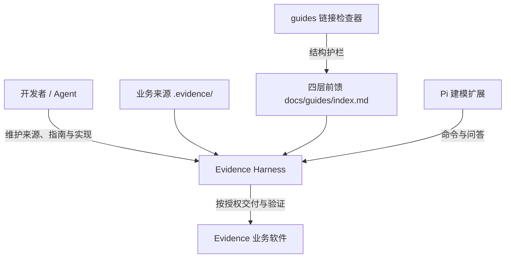
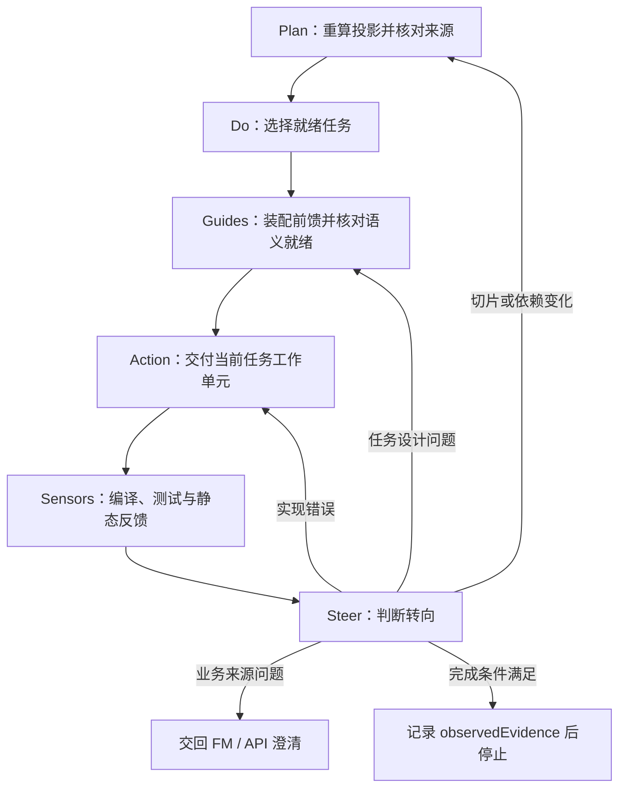
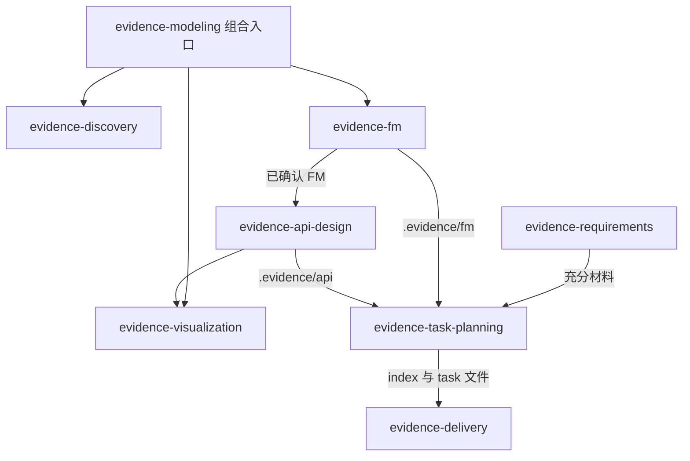
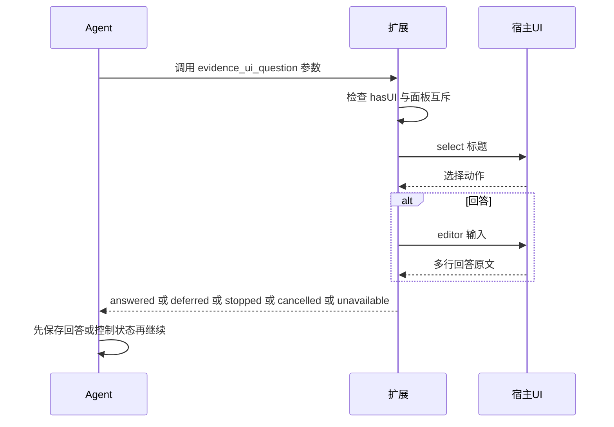
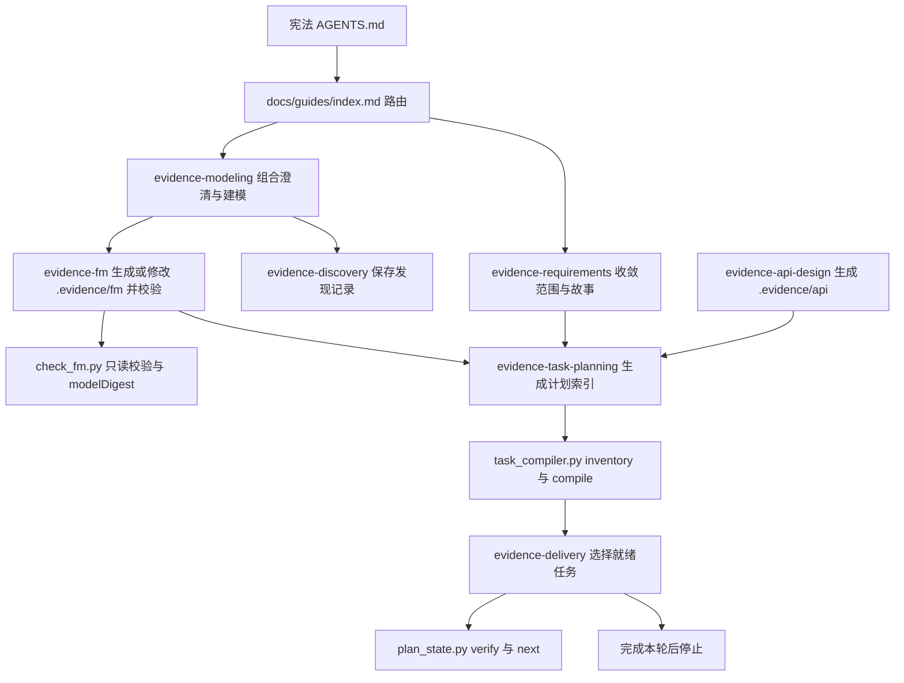

# Evidence Harness 系统

Evidence Harness 是仓库里把**业务来源**转成**已验证软件变更**的交付机制。在 [架构基线](../../docs/architecture/overview.md) 的 C4 系统上下文中，它对应 `Developer / Agent → Harness → System` 这条边：Harness 按授权把 `.evidence/` 里的业务事实与接口设计交付成后端/前端实现，并用可重复检查证明结果。

Harness 由四类组件拼装而成：

| 组件                 | 位置                                | 职责                                                    |
| -------------------- | ----------------------------------- | ------------------------------------------------------- |
| evidence-\* Skill 集 | `.agents/skills/`                   | 可移植的方法：澄清、建模、需求、API、规划、交付、可视化 |
| Pi 建模扩展          | `.pi/extensions/evidence-modeling/` | 项目级交互适配器：一个命令 + 一个问答工具，不存业务状态 |
| 四层前馈路由         | `docs/guides/index.md`              | 宪法 → 项目基线 → 工程指南 → 任务 Guides 的按任务装配   |
| Guides 链接检查器    | `tools/guides/check.mjs`            | 前馈文档结构护栏：扫描范围、本地链接、越界与过期表述    |

四类组件不互相复制职责：Skill 保存**可移植方法**，项目文档保存**本仓库实际范围与工程决定**，扩展只做**交互入口**，检查器只做**结构校验**。



上图是 Harness 的装配关系：前馈决定每个任务加载哪些来源，Skill 提供执行方法，扩展提供交互入口，检查器守护前馈文档本身，Harness 最终按授权作用于业务软件。

## 双层循环

交付采用**外层 PDCA + 内层 Guides → Action → Sensors → Steer**。外层管任务生命周期，内层管单次交付的操控；两者都记录在仓库文件里，不在扩展或 Skill 中建立私有推进状态。宪法固定这一结构，`evidence-delivery` 定义其完整协议。



内层和外层都以“完成本轮后停止”为退出条件：不自动推进下一个任务，不自动进入下游流程。

## evidence-\* Skill 集：可移植方法层

Skill 统一放在 `.agents/skills/`，命名 `evidence-<职责>`，目录名与 frontmatter `name` 一致。Skill 是**方法载体**：它描述“怎么做、用什么技术 profile、校验什么”，但不描述本仓库的金额、期限、接口数量或模块边界；这些事实由项目文档与 `.evidence/` 维护。

| Skill                    | 职责                                        | 产物/依赖                                   |
| ------------------------ | ------------------------------------------- | ------------------------------------------- |
| `evidence-modeling`      | 显式组合入口，编排澄清、建模、校验          | 组合 discovery 与 fm；界面扩展可选          |
| `evidence-discovery`     | 访谈与澄清，保存原话与问题状态              | 通用访谈只需对话；FM 专业判断按需读 fm 参考 |
| `evidence-fm`            | FM v3 建模准则、正式术语、源 YAML、验证场景 | 校验需要 Python 3.10+                       |
| `evidence-visualization` | 离线只读可视化审核页                        | Python；浏览器回归需要 Node 与 Chrome       |
| `evidence-requirements`  | 收敛软件职责、MVP、故事与验收               | 对话与文本文件                              |
| `evidence-api-design`    | 整体 API 设计、HTTP 契约、OpenAPI           | Python + 可定位的 evidence-fm               |
| `evidence-task-planning` | FM 到 smart-domain 实施任务规划             | Python 3.10+、PyYAML；不实现产品代码        |
| `evidence-delivery`      | 双层循环交付，执行就绪任务并记录证据        | Python 3.10+、PyYAML、项目工具链            |

关键边界：`evidence-modeling` 是唯一由用户显式调用的**组合入口**，它只负责编排，通过宿主的资源发现定位专业 Skill，不假设兄弟目录或固定安装路径，也不另造一套 FM 语义；访谈方法归属 `evidence-discovery`，正式模型与当前 Schema 判断归属 `evidence-fm`。专业 Skill 不自动串联，普通回答或“停止”不授权修改模型。



上图表达 Skill 之间的调用方向：modeling 组合澄清与建模，api-design 消费已确认 FM，planning 消费 FM/API 产出计划，delivery 消费计划执行。可视化只读消费 FM/API，不参与修改链。

Skill 的安装入口是：

```bash
npx skills@latest add ./.agents/skills --skill evidence-discovery
```

完整复制某个目录时需保留 references、assets、scripts、schemas、requirements.txt，不能只复制 SKILL.md；已有同名目录先比较备份，不直接覆盖。

## Pi 建模扩展：项目级交互适配器

`.pi/extensions/evidence-modeling/` 是 Pi 宿主的项目级扩展。它只注册一个命令和一个问答工具，把交互转给 Skill，把业务状态留在 `.evidence/`。

`index.ts` 是扩展入口：创建 `QuestionUI`、调用 `registerModelingCommand`，并注册工具 `evidence_ui_question`。工具参数是 `questionId`、`gapKey`、`prompt`、`impact`、`contextSummary`、`sourceRefs`，只返回人工交互结果，不保存业务记录。

`commands.ts` 注册 `/evidence-model`：先通过 `getCommands()` 判断宿主是否已发现名为 `skill:evidence-modeling`、`source === 'skill'` 的原生命令；存在时把用户目标转发为 `/skill:evidence-modeling <目标>`，并带 `expandPromptTemplates: true`。无参数时弹出菜单选择单一意图：

| 菜单项                 | 转发语义                   |
| ---------------------- | -------------------------- |
| 讨论业务               | 只整理发现记录，不修改模型 |
| 生成或修改模型         | 直接编辑当前 FM 并校验     |
| 只校验模型             | 只读检查，不修改源文件     |
| 返回 / 关闭 / 空白目标 | 不发送消息                 |

资源缺失只提示安装问题，不创建业务问题；新布局由 Skill 定义，扩展不复制路径配置。



`QuestionUI` 的返回状态由 `ui-contracts.ts` 定义为 `answered | deferred | stopped | cancelled | unavailable`；回答原文原样保留，空白提交视为 `cancelled`；无 UI 或已有面板占用时返回 `unavailable`。面板互斥只在进程内存在。

扩展的边界不变量由 `index.spec.ts` 固定：它不注册 `agent_settled`、`tool_call`、`ToolLease`、`StateStore`，不写 `.evidence/evidence-modeling`，不含 `writeFile`、`appendEntry`、`apply_candidate`、`pi.exec`，不从 `evidence/` 目录导入。扩展不读不写模型、不做版本操作、不自动推进，回答不等于修改模型的授权。

## 四层前馈路由

`docs/guides/index.md` 是前馈的**唯一路由页**。它把每次交付需要的知识分成四层，每层有唯一职责：

| 层                      | 唯一职责                                        | 使用方式         |
| ----------------------- | ----------------------------------------------- | ---------------- |
| 项目宪法（`AGENTS.md`） | 权限、硬约束、停止纪律                          | 每次必读         |
| 项目基线                | 软件范围、业务与 API 来源、架构、术语、质量要求 | 按任务选择       |
| 工程指南                | 规范、操作方法、带测试的真实范例                | 按改动类型选择   |
| 任务 Guides             | 当前交付结果、来源、局部设计、文件范围、CHECK   | 执行当前任务必读 |

装配纪律是：每次开工、恢复、来源变化或纠偏后**重新装配**；同一来源只加载一次，长文件只读相关章节与真实源码符号。路由页只做路由，不保存第二份事实、任务状态或完成证据，没有读取的来源不能声称已核对。

来源冲突时，先说明各自管辖范围及差异，停止受影响行动，交由相应拥有者确认；不能按读取先后、修改时间或“代码已经这样写了”裁决。进入 Action 前的六项开工检查（授权与目标、来源、前置与新鲜度、设计、做法与环境、验证与退出）逐项核对并引用来源，不另建“前馈状态表”。

## Guides 链接检查器：结构护栏

`tools/guides/check.mjs` 是前馈文档的结构检查器。它只扫描**当前维护中的指南**，不扫描业务源 YAML、生成产物、历史证据、第三方材料或评测夹具。

扫描范围由两个常量决定：

- `requiredDocuments`：宪法 `AGENTS.md`、根 `README.md`、路由页、后端切片 README、`.evidence/README.md`、`.evidence/api/README.md`、Skills 索引以及 `evidence-task-planning` / `evidence-delivery` 的 SKILL.md。
- `documentationTrees`：`docs`、`evidence-task-planning` 的 references 与 assets、`evidence-delivery` 的 references；递归收集其中的 `.md`，跳过点开头条目和符号链接。

`checkDocuments` 对每个文档校验存在性、真实路径不越出项目根、不含过期架构表述（`分布式单体 | distributed[ -]monolith`），并在剥离代码围栏后提取有界的内联链接：跳过远程链接、本地锚点、模板变量，对相对链接做 URL 解码后按文档所在目录解析，报告目标缺失、越出根目录、经符号链接越界三类错误。它**不**校验引用式链接、标题锚点或外部 URL 可达性，也不是完整 Markdown 解析器。

验证入口在 `package.json` 中：

```text
guides:verify  =  guides:test  +  guides:check
guides:test    =  node --test tools/guides/check.spec.mjs
guides:check   =  node tools/guides/check.mjs  +  prettier --check <前馈文档集合>
```

`guides:verify` 只证明文档结构（扫描范围、本地内联链接、过期表述、格式），不证明任务语义就绪或业务批准；这一点在 [测试指南](../../docs/engineering/testing.md) 中明确记录。

## 组件发现与 .evidence 共享产物

Skill 之间**不假设兄弟目录**：`evidence-modeling`、`evidence-discovery`、`evidence-api-design`、`evidence-visualization` 都通过宿主资源发现或用户提供的绝对路径定位其他 Skill；CLI 的 `.agents/skills/` 便利默认值只是回退，不是发现机制。

新产物默认统一放在项目根 `.evidence/`，沿用已有文件与用户显式指定位置，不自动迁移：

```text
.evidence/
├── discovery.md          # 来源、原话、工作理解、问题与恢复点
├── questions.md          # 可选：已提问题及回答
├── fm/                   # 唯一当前模型，直接编辑；generated 为可重建派生结果
├── views/index.html      # 可选离线只读审核页
├── api/
│   ├── api.yaml          # 唯一 API 设计源，位于 FM 根之外
│   └── generated/<批次>/ # 投影、OpenAPI、契约、样例、manifest
└── checks/
    ├── fm/               # 获授权留存的 FM 检查记录
    └── api/              # 获授权留存的 inspect/check 结果
```

规划与需求使用项目文档目录：`evidence-requirements` 默认 `docs/requirements/scope.md` 与 `stories.md`；`evidence-task-planning` 默认 `docs/plans/smart-domain/index.md` 与 `tasks/<具体交付结果>.md`。各 Skill 只修改本次授权文件，不自动批准；`.evidence/` 只是默认产物根，不因此获得其他文件或审核状态的修改权限。

## 端到端控制流



从宪法进入后，建模链产出 `.evidence/fm`（与可选 `.evidence/api`），需求收敛与规划把业务职责切成 smart-domain 任务，交付层用只读脚本重算投影并执行一个就绪任务，最后停止。规划与交付阶段不执行产品实现；`evidence-delivery` 消费同一索引与任务文件，不在扩展中建立私有状态。

## 状态、不变量与失败语义

- **编辑授权 ≠ 业务批准**：生成/修改授权只覆盖本次范围；模型默认 `draft` / `stakeholderReview: pending`，机器校验通过不提升 `modelStatus` 或 `stakeholderReview`。写入、机器检查与具名业务批准始终相互独立。
- **`taskNotes` 是任务状态唯一位置**：详情文件通过 `taskKey` 与 `planRef` 绑定索引，不复制依赖图或状态；`observedEvidence` 只记录真实观察，`compiled` 是每次按当前输入重算的计算投影，`next` 只提供结构候选，不证明语义就绪。
- **每次只执行一个获授权且就绪的任务**，完成后停止；缺口只阻塞受影响任务，不通过改上游、删测试或扩范围制造通过。
- **FM/API 摘要不覆盖工程指南**：规范、架构、howto 或代码变化必须显式评估重验；源摘要、代码与 CHECK 环境变化会使旧证据失效。
- **校验失败不自动回滚**：保留真实错误与已修改文件，明确“当前模型未通过”或“未校验”；`check_fm.py` 的 `inputChanged` 表示检查期间输入变动，旧记录不能证明当前版本有效。
- **扩展无副作用**：启动、重载、关闭不写文件，不替换系统提示或工具集，不注册自动推进、路径拦截或 Session 恢复逻辑。

## 扩展点

- 新 Skill：在 `.agents/skills/` 增加 `evidence-<职责>/SKILL.md`（frontmatter `name` 与目录名一致），并遵循“可移植方法 vs 项目基线”的分离；若纳入 Guides 扫描，把目录加入 `check.mjs` 的 `documentationTrees`。
- 新交互：Pi 扩展可新增命令或工具，但必须保持“只做交互、不存业务状态”的边界，并把验证加入 `evidence-modeling:test`。
- 新前馈来源：在 `docs/guides/index.md` 的阅读路由与来源冲突表中登记权威位置，同步更新引用它的导航、Skill、任务模板和检查。

## 配置与运维

| 目的         | 命令                                                                                       |
| ------------ | ------------------------------------------------------------------------------------------ |
| 前馈结构验证 | `npm run guides:verify`                                                                    |
| 建模扩展验证 | `npm run evidence-modeling:verify`                                                         |
| Skill 回归   | `npm run skills:verify`（含 `run_skill_tests.py` 逐套件隔离运行）                          |
| FM 只读校验  | `python3 <fm-skill>/scripts/check_fm.py <model_dir>`                                       |
| 规划投影     | `python3 <planning-skill>/scripts/task_compiler.py inventory/compile --fm ... [--api ...]` |
| 交付状态     | `python3 <delivery-skill>/scripts/plan_state.py verify/next --index <index.md>`            |

`check_fm.py` 输出 JSON 并绑定 `modelDigest`（排除 `generated` 与字节码）；没有适用场景时 `simulationPassed` 为 `null`，不宣称模拟通过。`task_compiler.py` 的 `taskKey = encode(concern) :: encode(ownerRef) :: encode(operationRef)`，文件名只面向人、不参与任务身份或执行顺序。`plan_state.py` 只读校验索引结构与候选任务，不替 Agent 修改状态。

## 聚焦测试

- Pi 扩展：`commands.spec.ts`（命令转发、三种意图授权边界、资源缺失、空白目标）、`index.spec.ts`（只注册命令与工具、无运行状态/写入/自动推进钩子）、`question-ui.spec.ts`（多行回答原样保留、各状态映射、无 UI 降级、异常释放面板、单面板互斥）。
- Guides 检查器：`tools/guides/check.spec.mjs` 覆盖工序路由、相对路径/编码/尖括号路径解析、缺失文档与行号、围栏/远程/锚点/模板变量忽略、非法编码与越界、符号链接越界、过期架构表述、扫描范围。
- Skill 套件：`run_skill_tests.py` 发现 `*/tests` 与 `*/tests/portability` 并在独立解释器中运行 `unittest discover`；FM 另有功能回归与夹具，planning 验证确定性身份/依赖/覆盖，delivery 验证只读状态检查与执行/恢复前馈协议。
- 这些自动回归与人工行为评价分开，没有执行的评测不能记为通过。
