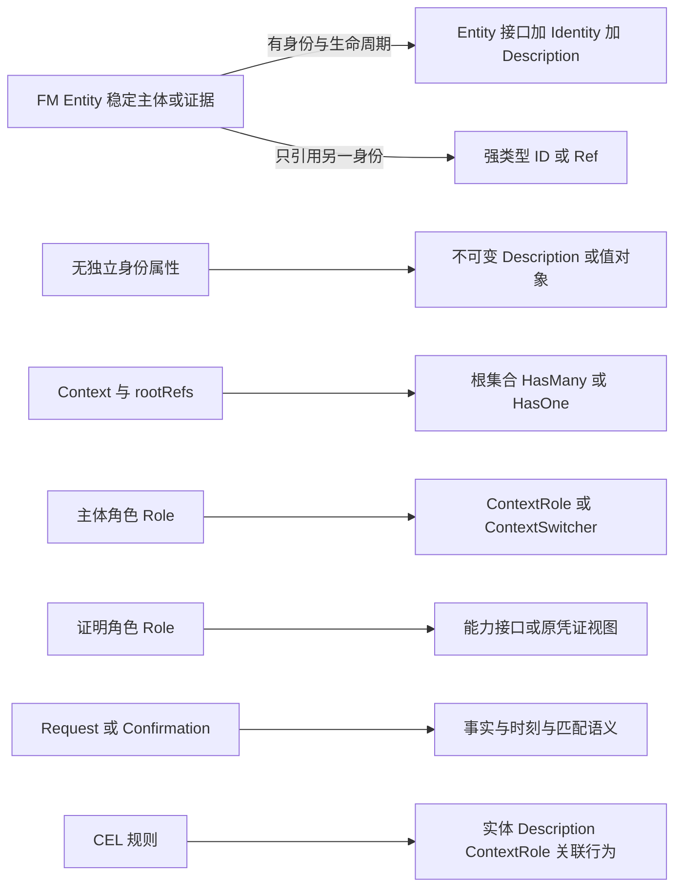
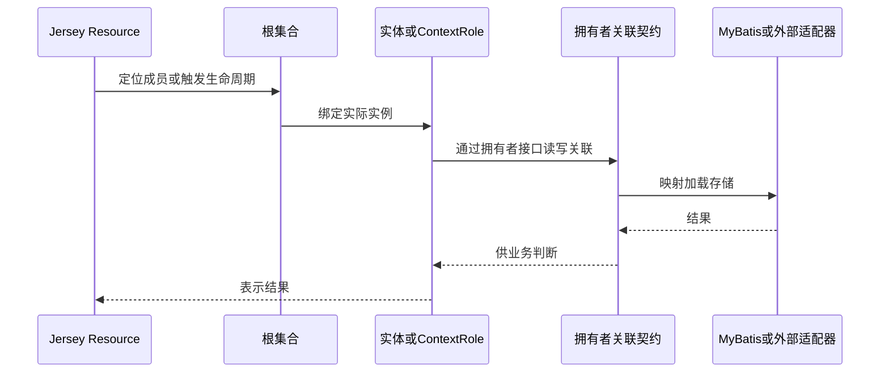

# FM 到实现映射

业务含义唯一维护在 [FM 模型](../../.evidence/fm/model.yaml)、[业务概览](../../.evidence/fm/00-overview.md)和[正式术语](../../.evidence/fm/01-glossary.md)。本页只规定从 FM 到代码的映射，不建立第二套业务事实；代码、HTTP 和 SQL 名称是映射结果，不是新的业务身份。

## 定位与入口

FM 的入口上下文在 `model.yaml` 的 `entryContextRefs` 声明为 `context.subscription`、`context.mobile`、`context.prepaid`、`context.content`。实现落点固定在统一后端应用的三个技术库：`libs/backend/domain`（身份、Description、实体/角色行为、关联契约）、`libs/backend/api`（Resource、请求、表示）、`libs/backend/persistent`（关联适配器、Mapper、迁移）。

映射有两个消费入口：

- **规划**：`evidence-task-planning` 读取 FM 源 ID，产出按 `type + sourceRef` 生成的工作单元与任务；任务身份来自源 ID，不来自 Java 类名。
- **实现**：每个实际任务必须引用它消费的源 ID（如 `party.user`、`role.payment-proof`、`rule.payment-completed`），而不是只引用本页。

## 概念映射

下表是 FM 概念到 smart-domain 落点的主映射。左边是业务含义，中间是实现选择，右边是必须拒绝的机械推导。

| FM 概念                         | smart-domain 落点                                                                  | 不允许的推导                                     |
| ------------------------------- | ---------------------------------------------------------------------------------- | ------------------------------------------------ |
| 稳定主体 / Thing / Party        | 按业务身份、属性与生命周期选择 `Entity<Identity, Description>`、强类型 ID 或 `Ref` | 每个声明 ID 都是数据库主键；每个节点都建表       |
| 无独立身份的描述                | 不可变 `Description` / 值对象                                                      | 为 HTTP 可写性破坏不可变性                       |
| Context / `rootRefs`            | 业务边界 + 根集合入口（`HasMany`/`HasOne`）；成员拥有行为                          | 每个 Context 自动建服务；所有对象全局 CRUD       |
| 主体角色                        | 绑定可信 Actor 与实际 Context 的 `ContextRole` / `ContextSwitcher`                 | 角色名等同登录认证或权限凭证                     |
| 证明角色                        | 消费方能力接口或原凭证包装视图                                                     | 新建一份证明及签发时刻；把资金责任转移给消费者   |
| 关联                            | `HasOne`、`HasMany`、具名 `Optional` 或关系实体                                    | 为只读关系虚构写能力；用公共可变集合泄露内部状态 |
| Evidence Request / Confirmation | 保留事实、实际时刻、匹配与数量语义；凭证追加                                       | 请求受理等于到账/完成；以状态覆盖删除历史违约    |
| Rule（CEL）                     | 实体、Description、ContextRole 及拥有者关联的行为                                  | 放入 Resource、Mapper 或无领域责任的 Service     |

上图为 FM 概念到实现落点的映射；每条边是映射选择，不是自动生成。

## 请求路径与行为归属

业务规则必须落在实体、Description、ContextRole 与拥有者关联上。运行时路径为：

请求沿此路径流转；业务规则只属于实体、Description、ContextRole 与拥有者关联。

这条路径的硬约束见[设计规则](../../.agents/skills/evidence-task-planning/references/design-rules.md)：业务规则不能进入 Resource、Mapper、技术事务包装器或负责拼接 Repository 的 Service/Handler。bootstrap 只做装配；领域不反向依赖 Spring、Jersey、Jackson、MyBatis。组合根不得成为业务 Service。

## 身份、生命周期与时间语义

FM 声明 ID 是模型类型身份，不自动等于领域实例主键；确定 Entity / Description / 值对象要依据业务身份、属性和生命周期，不机械地为每个节点生成实体表。

关键值的记录方式必须分清直接记录、引用、确定性派生与未知来源，且代码赋值来源与模型字段来源不可混为一谈：

- `Request/RFP/Proposal` 保留 `started_at`、`expired_at`；`Contract` 用 `signed_at`；`Confirmation` 用 `confirmed_at`；补充凭证用 `created_at`。不为时刻凭证补区间。
- 业务签署、扣减、到账、提供时刻不同于建档、回调到达和服务器当前时间；原事件时刻不同于记录形成时刻。
- 请求受理不等于履约完成；凭证按实际业务约束追加，不以状态覆盖抹去迟到、冲正或历史违约。
- 幂等通知不等于两个不同结果是同一事实；规则的 `exists`、精确数量、聚合、边界闭合、币种与实例匹配均保留。

例如 `rule.payment-completed` 要求 `proofs.filter(...).size() == 1` 且 `confirmed_at` 落在请求区间内；`rule.payment-expired` 只依据 `now > expired_at` 且不存在合格证明。这些精确语义由对应 YAML 维护，实现不得复制成简化状态位。

## 命名与字段追溯

新增实体/属性时记录中文、英文代码名、源 ID、API 字段与 SQL 列名；含义或名称存在歧义时回到来源确认，不新增同义类绕过已有拥有者。通用工程词汇见[命名规范](../../docs/engineering/conventions.md)。

| 中文定位               | 源标识 / 字段                               | 实现映射纪律                                       |
| ---------------------- | ------------------------------------------- | -------------------------------------------------- |
| 用户主体               | `party.user`                                | 已有 `User` / `Users`；不为读者、支付用户复制主体  |
| 读者角色               | `role.reader`                               | 上下文角色，不能合并为通用 User 权限字段           |
| 合格付款证明           | `role.payment-proof`                        | 证明能力，不对应新的资金结果表                     |
| 专栏 / 上架版本        | `column_id` / `edition_id`                  | 身份粒度不同，不能互换或只保留当前版本             |
| 请求开始 / 截止        | `started_at` / `expired_at`                 | Java 使用对应 camelCase 时保持业务含义与边界闭合   |
| 签约 / 确认 / 补充记录 | `signed_at` / `confirmed_at` / `created_at` | 不统称 `createdAt`；通知到达另有含义               |
| 显示名称               | 本地软件字段 `displayName`                  | SQL `display_name`；非 FM 属性，范围见用户切片说明 |

Java 类型使用 PascalCase，方法/字段 camelCase，SQL 表/列 snake_case，迁移沿用 Flyway `V<版本>__<描述>.sql`。英文名称不构成新业务身份。

## 已有切片：`party.user` 映射

当前唯一落地的切片是用户主体资料，它是映射纪律的完整示例：

| 责任             | 落点                                                                                                                                                                                                                                                                                       |
| ---------------- | ------------------------------------------------------------------------------------------------------------------------------------------------------------------------------------------------------------------------------------------------------------------------------------------ |
| 业务来源         | `party.user` 提供稳定主体概念；`displayName` 来自独立软件切片说明，不冒充 FM 属性                                                                                                                                                                                                          |
| 根集合公开契约   | [`Users`](../../libs/backend/domain/src/main/java/com/evidencepoc/backend/domain/model/Users.java) 继承 `HasMany<String, User>`，提供 `create`/`update`/`delete`，不是认证授权 API                                                                                                         |
| 成员行为         | [`User`](../../libs/backend/domain/src/main/java/com/evidencepoc/backend/domain/model/User.java) 无关联叶子 `Entity`；[`UserDescription`](../../libs/backend/domain/src/main/java/com/evidencepoc/backend/domain/description/UserDescription.java) 校验非空、非空白、长度 ≤ 100 且原样保留 |
| 数据与迁移拥有者 | persistent `Users` 适配器拥有 `app_users` 写入与 [`V1__create_users.sql`](../../libs/backend/persistent/src/main/resources/db/migration/V1__create_users.sql)                                                                                                                              |
| 字段追溯         | 领域 `displayName` → API/JSON `displayName` → SQL 列 `display_name`，同一含义三层命名                                                                                                                                                                                                      |
| 消费边界         | 通过根集合与成员契约操作；其他模块不得直接依赖 `UsersMapper` 或读写私有表                                                                                                                                                                                                                  |

`User` 的私有构造器专供 smart-domain 叶子实体水合，不是公开创建路径；`Users` 适配器用 `UUID.randomUUID()` 生成身份并检查写操作影响行数，写方法标注 `@Transactional` 参与 Spring 本地事务。该切片的删除、覆盖写入与分页界限不自动推广到存在业务引用的主体生命周期。

## 证明角色与跨上下文

`role.payment-proof` 没有自己的签发人、时间或凭证实例。付款规则只绑定这个证明约定；实际资金结果仍属于移动支付或账户合同。具体凭证通过 `plays_role` 关系扮演证明角色：`confirmation.mobile` 与 `confirmation.prepaid` 分别扮演 `role.payment-proof`。

实现的推论是：订阅上下文只依赖证明约定（消费方能力接口或原凭证包装视图），不复制移动扣款/余额抵扣的本平台 API，也不把资金责任转移给订阅履约。新增支付方式通过新的具体凭证和扮演关系接入，不复制订阅付款履约。实现了证明接口不表示证明合格；匹配、数量、时间、来源与可见性由源规则判断。

## 扩展点

- **新业务模块**：FM 的订阅、移动支付、预付费账户与内容上下文不是自动生成的模块列表。业务模块按行为内聚性、数据所有权与变更原因确定，通过 `designItems` 登记拥有者、公开契约、数据所有权、依赖方向与本地事务边界。
- **新支付方式 / 新证明玩家**：新增具体证据并增加 `plays_role` 关系即可接入既有证明角色，不改写原履约。
- **任务身份**：工作单元按 `type + sourceRef` 生成稳定 key，任务 key 由 concern/ownerRef/operationRef 生成；源 ID、业务场景与 CHECK 标识各有身份，不与 taskKey 混用。规划命令见[切片策略](../../.agents/skills/evidence-task-planning/references/slicing-policy.md)。

## 失败不变性与测试分工

四个技术层的测试各证其责，不能互相冒充：

| 层         | 证明什么                                  |
| ---------- | ----------------------------------------- |
| domain     | 业务判断与固定边界；不证明 HTTP/SQL       |
| api        | 协议与调用边界；不证明业务规则、SQL、事务 |
| persistent | SQL、加载、hydrate、批量/分页、并发与回滚 |
| app        | 真实装配、配置、profile 隔离与架构检查    |

业务期望不得从当前实现输出反推。例如恰到付款截止、晚到证明、退款后旧版资格与历史履约必须分别判断；精确规则仍引用对应 YAML，不在实现指南复制金额/时限。真实数据库并发、唯一性、版本/锁、原子变更与证据追加需要真实数据库验证，顺序 Fake 不能证明并发安全。

## 相关页面

- [后端模块化单体架构](../architecture/backend.md)：技术分层与 HTTP → 领域 → MyBatis 请求路径。
- [模块边界](../../docs/architecture/modules.md)：业务模块与数据所有权。
- [上游依据](../../.agents/skills/evidence-task-planning/references/upstream.md)：smart-domain 固定 commit 与兼容范围。
