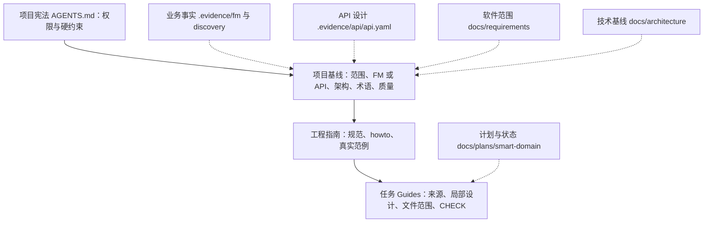

# 权威来源与前馈

Evidence 仓库把「业务是什么、本次软件负责什么、技术怎么选、任务现在处于什么状态」拆成**单一职责来源**，再通过**前馈**按当前任务装配。来源、派生结果与当前代码之间保持严格方向：来源向下定义派生结果和实现，生成产物与已有代码不能向上重新定义业务。写入权限、机器检查与具名业务批准是三个独立环节。

## 单一职责来源模型

每个事实类别只有一个权威位置，其他内容不能冒充它：

| 问题                 | 权威位置                                                                                                 | 不能替代它的内容                 |
| -------------------- | -------------------------------------------------------------------------------------------------------- | -------------------------------- |
| 业务事实与审核状态   | [FM 源入口](../../.evidence/fm/model.yaml)、[发现记录](../../.evidence/discovery.md)                     | 当前代码、生成报告、Agent 推测   |
| 接口能力与 HTTP 契约 | [api.yaml](../../.evidence/api/api.yaml)                                                                 | Resource 实现、过期 OpenAPI      |
| 本次软件负责什么     | [软件范围](../../docs/requirements/scope.md)、[故事验收](../../docs/requirements/stories.md)             | FM 中存在的所有活动              |
| 技术选择与模块边界   | [架构基线](../../docs/architecture/overview.md)、[模块设计](../../docs/architecture/modules.md)          | 目录名、参考产品或模板默认业务   |
| 业务术语             | [正式术语](../../.evidence/fm/01-glossary.md)                                                            | 另写一份业务词典                 |
| 英文代码与字段映射   | [领域映射](../../docs/architecture/domain-mapping.md)、[通用命名](../../docs/engineering/conventions.md) | 用同义词制造新业务对象           |
| 执行顺序与状态       | 计划索引的 `compiled` / `taskNotes`                                                                      | 文件名编号、聊天记忆、README     |
| 当前是否验证         | 任务 CHECK 的本次实际结果                                                                                | 文件存在、上次通过或模板中的预期 |

对应的仓库职责分工在根 [README](../../README.md) 的「仓库中的唯一职责」中固定：`.evidence/fm/` 保存当前 FM、正式术语、规则与回放场景，`.evidence/api/api.yaml` 保存当前 API 设计源，`docs/requirements/` 保存软件职责与质量属性，`docs/architecture/` 保存技术基线与领域映射，`docs/plans/smart-domain/` 保存计划与任务状态，`.evidence/checks/` 保存获授权留存的真实检查记录。

### 生成产物不是新的事实源

`.evidence/fm/generated/` 是从当前源 YAML 与 validation 重建的派生产物，`.evidence/api/generated/` 是从 `api.yaml` 投影出的接口清单、HTTP 契约、OpenAPI、表示样例、流程与机器投影。它们用于定位能力和辅助审核，**不覆盖源文件，也不是已部署接口或本次校验结果**。消费时应核对源摘要、审核状态和实际检查版本，源或校验器变化后必须重验，不能把目录里有报告视为本次通过。

### 当前代码不能反向定义业务

已有实现是候选工程范例，不是业务事实的替代来源。代码、HTTP 与 SQL 名称是业务含义到实现的**映射结果**，英文名称不构成新的业务身份；例如本地用户切片的 `displayName` 是软件字段，不假称来自 FM。业务期望不得从当前实现输出反推，冲突时必须指出而非自行择一。

## 前馈四层与装配

`docs/guides/index.md` 是前馈的**唯一路由页**，把每次交付需要的知识分成四层，每层有唯一职责：

| 层                                       | 唯一职责                                        | 使用方式         |
| ---------------------------------------- | ----------------------------------------------- | ---------------- |
| 项目宪法（[AGENTS.md](../../AGENTS.md)） | 权限、硬约束、停止纪律                          | 每次必读         |
| 项目基线                                 | 软件范围、业务与 API 来源、架构、术语、质量要求 | 按任务选择       |
| 工程指南                                 | 规范、操作方法、带测试的真实范例                | 按改动类型选择   |
| 任务 Guides                              | 当前交付结果、来源、局部设计、文件范围、CHECK   | 执行当前任务必读 |

前馈按任务从四层装配；权威来源注入项目基线或任务 Guides，路由页只做路由。

装配纪律是：每次开工、恢复、来源变化或纠偏后**重新装配**；同一来源只加载一次，长文件只读相关章节与真实源码符号。路由页不保存第二份事实、任务状态或完成证据，没有读取的来源不能声称已核对。进入 Action 前逐项完成六项开工检查——授权与目标、来源、前置与新鲜度、设计、做法与环境、验证与退出——并在任务详情引用来源，不另建「前馈状态表」。检查通过只表示本次行动依据就绪，不表示实现或业务获批。

## 状态与生命周期

- **业务模型状态**：`model.yaml` 当前为 `modelStatus: draft`、`stakeholderReview.status: pending`。机器校验通过不提升状态；只有真实具名审核依据才反映其他状态，更改已审核语义时回到 draft / pending 并等待重新审核。
- **计划与任务状态**：`taskNotes` 是任务状态唯一位置，`compiled` 是每次按当前输入重算的计算投影，任务详情通过 `taskKey`/`planRef` 绑定索引、不复制依赖图或状态。`observedEvidence` 只记录真实观察，计划生成时为空；失败与未知保留在 `gaps`，只阻塞受影响任务。
- **计划路径只是约定**：`docs/plans/smart-domain/index.md` 与 `tasks/*.md` 是工作流输出约定，不表示仓库已经有可执行计划。没有有效索引时先规划，不根据代码存在或聊天记忆跳到实施。
- **检查记录是历史证据**：`.evidence/checks/` 保存获授权留存的真实输出；环境失败、历史结果、缓存命中与业务批准分别说明，不能用上次通过替代本次执行。

## 失败语义与不变量

- 来源冲突时，先说明各自管辖范围及差异，停止受影响行动，交由相应拥有者确认；不能按读取先后、修改时间或「代码已经这样写了」裁决。
- 写入、机器检查与业务批准相互独立：生成/修改授权只覆盖本次范围，普通回答或「停止」不授权修改模型；结构自洽、文件写入和命令成功不能替代业务批准。
- FM/API 摘要不覆盖工程指南：源摘要、规范、架构、howto、代码或 CHECK 环境变化都会使旧证据失效，必须显式评估重验。
- 环境不可用记为环境阻塞，不伪装成业务失败；代码问题在本任务范围内修复，任务设计问题修订详情，业务来源问题交回 FM/API 拥有者，不通过改上游、删测试或扩范围制造通过。

## 扩展点

- **新前馈来源**：在 [Guides 导航](../../docs/guides/index.md) 的阅读路由与来源冲突表中登记权威位置，同步更新引用它的导航、Skill、任务模板和检查；新增规范应指出对应测试或人工评估。
- **新 Skill**：在 `.agents/skills/` 增加 `evidence-<职责>/SKILL.md`，保持「可移植方法 vs 项目基线」的分离；若纳入 Guides 扫描，把目录加入 `tools/guides/check.mjs` 的 `documentationTrees`。
- **新业务/接口事实**：业务事实只写入 `.evidence/fm/`，API 事实只写入 `.evidence/api/api.yaml`，不在 Skill、扩展或聊天记忆里建立第二份副本。

## 配置与运维

| 目的                 | 命令                                                                                                                                                                                                 |
| -------------------- | ---------------------------------------------------------------------------------------------------------------------------------------------------------------------------------------------------- |
| 前馈结构验证         | `npm run guides:verify`（`guides:test` + `guides:check`）                                                                                                                                            |
| FM 只读校验          | `python3 .agents/skills/evidence-fm/scripts/check_fm.py "$PWD/.evidence/fm"`                                                                                                                         |
| API 完整性与契约校验 | `python3 .agents/skills/evidence-api-design/scripts/fm_api.py check --project-root "$PWD" --fm "$PWD/.evidence/fm" --fm-skill "$PWD/.agents/skills/evidence-fm" --api "$PWD/.evidence/api/api.yaml"` |
| 计划投影             | `python3 .agents/skills/evidence-task-planning/scripts/task_compiler.py inventory/compile --fm ... [--api ...]`                                                                                      |
| 交付状态只读检查     | `python3 .agents/skills/evidence-delivery/scripts/plan_state.py verify/next --index <index.md>`                                                                                                      |

`guides:verify` 只证明前馈文档结构，不证明任务语义就绪或业务批准；`plan_state.py` 只读校验索引结构与候选任务，不替 Agent 修改状态。

## 聚焦测试

- `tools/guides/check.spec.mjs`：覆盖工序路由、相对路径/编码/尖括号路径解析、缺失文档与行号、围栏/远程/锚点/模板变量忽略、非法编码与越界、符号链接越界、过期架构表述与扫描范围。
- `evidence-fm` / `evidence-api-design` / `evidence-task-planning` / `evidence-delivery` 的 Python 套件分别验证「校验不提升审核状态」「投影不回写 API 源」「确定性 taskKey/依赖/覆盖」「只读状态检查与执行/恢复前馈协议」。
- 这些自动回归与人工行为评价分开，没有执行的评测不能记为通过；测试与评测文件不是本项目的业务来源。

## 相关页面

- [Evidence Harness 系统](../architecture/harness.md)：前馈路由与 Harness 四类组件的装配关系。
- [FM 到实现映射](domain-mapping.md)：代码/HTTP/SQL 名称是映射结果，不是新的业务身份。
- [验证闸门](../operations/verification.md)：各质量命令证明什么与不证明什么。
- [证据交付工作流](../workflows/evidence-delivery.md)：双层循环如何消费这些来源并记录状态。
