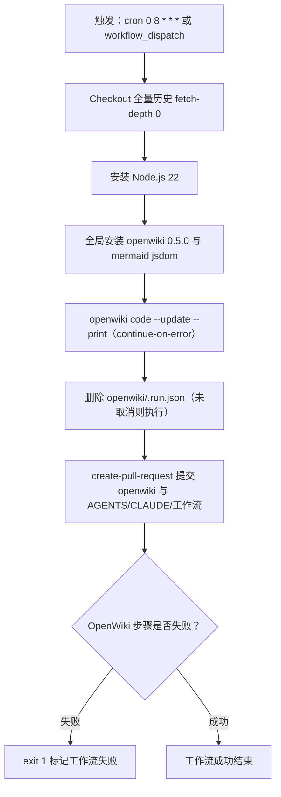

# OpenWiki 集成

OpenWiki 把仓库的**源码与文档**转成 `openwiki/` 下的生成式证据索引。它是一份**可选的即时上下文**，不是启动必读：真正的行为以源码和测试为准，OpenWiki 页面只是便于导航的派生视图。集成由三部分组成——一个定时更新的 GitHub Actions 工作流、一份告诉文档代理“不要读什么”的 `.openwikiignore`、以及 `openwiki/` 目录里由 OpenWiki 自己维护的运行状态与生成页面。

上图是工作流的主干：触发后跑一次 `openwiki code --update --print`，无论成败都清理临时状态并开 PR，最后仅在 OpenWiki 步骤失败时把整个工作流标成失败。

## 定时更新工作流

集成入口是 `.github/workflows/openwiki-update.yml`。它有两个触发源：每天的 cron 计划 `0 8 * * *`（UTC 08:00），以及手动的 `workflow_dispatch`。工作流请求 `contents: write` 与 `pull-requests: write` 两项权限，因为最终要提交 `openwiki/` 产物并创建拉取请求。

执行顺序如下：

1. **Checkout 全量历史**：使用 `actions/checkout@v4` 且显式 `fetch-depth: 0`。注释说明这是为了让 `openwiki code --update` 能把 HEAD 与它上次记录的 commit 做 diff；浅克隆会藏起那次 commit，导致更新跑在一份“空变更摘要”上。
2. **准备运行时**：`actions/setup-node@v4` 装 Node.js 22。
3. **安装 OpenWiki**：全局安装 `openwiki@0.5.0`，并附上可选的 `mermaid@11.16.0` 与 `jsdom@29.1.1`。这两个包只为给 Mermaid 图做高保真校验；没有图的 wiki 可以去掉。
4. **运行更新**：执行 `openwiki code --update --print`，并设置 `continue-on-error: true`。这样即使文档生成中途失败，后续清理与 PR 步骤仍会继续。
5. **清理运行状态**：在 `!cancelled()` 条件下删除 `openwiki/.run.json`。
6. **创建更新 PR**：在 `!cancelled()` 条件下用 `peter-evans/create-pull-request@v7` 创建分支 `openwiki/update` 的 PR，`add-paths` 限定为 `openwiki`、`AGENTS.md`、`CLAUDE.md` 和工作流文件本身。
7. **失败传播**：最后一步仅在 `steps.openwiki.outcome == 'failure'` 时执行 `exit 1`，把工作流标记为失败。

### 运行环境变量

更新步骤通过环境变量把模型提供方与追踪配置注入 OpenWiki：

| 变量                                                             | 作用                                          |
| ---------------------------------------------------------------- | --------------------------------------------- |
| `OPENWIKI_PROVIDER: openai-compatible`                           | 指定 OpenAI 兼容提供方                        |
| `OPENAI_COMPATIBLE_API_KEY` / `OPENAI_COMPATIBLE_BASE_URL`       | 提供方鉴权与端点，取自仓库 secret 与 variable |
| `OPENWIKI_MODEL_ID: deepseek-v4-pro`                             | 生成用的模型 ID                               |
| `OPENWIKI_LANGSMITH_API_KEY`                                     | LangSmith 连接器在 code 模式拉取时所需的鉴权  |
| `LANGSMITH_API_KEY`、`LANGCHAIN_PROJECT`、`LANGCHAIN_TRACING_V2` | 可选：把本次 OpenWiki 运行也追踪到 LangSmith  |

多工作区场景可以按注释再加 `OPENWIKI_LANGSMITH_API_KEY_2`、`_3` 等 secret 与对应环境项。

### 失败语义

工作流刻意把“生成失败”和“PR 仍然有用”分开。`continue-on-error: true` 让 OpenWiki 步骤失败时不中断流水线；PR body 会带上 `OpenWiki result: ${{ steps.openwiki.outcome }}`，并说明当结果是 `failure` 时，这个 PR **有意只保留失败前已经完成的页面**，合并它就能把这份进度作为下次定时运行的基线。最后一步 `exit 1` 只是让 GitHub 看到红色，不改变这个 PR 的内容。

## .openwikiignore 排除规则

`.openwikiignore` 限定文档代理**不得读取**的路径。它的目标是把构建产物、缓存和二进制排除掉：这些东西没有文档价值，却会占用大量上下文成本。

| 类别           | 排除项                                                                              |
| -------------- | ----------------------------------------------------------------------------------- |
| 依赖与缓存     | `node_modules/`、`.nx/`、`.gradle/`、`.cache/`                                      |
| 构建与临时输出 | `tmp/`、`dist/`、`build/`、`out-tsc/`                                               |
| 二进制资产     | `*.pdf`、`*.png`、`*.jpg`、`*.jpeg`、`*.gif`、`*.webp`、`*.zip`、`*.jar`、`*.class` |

这个列表与 `.gitignore` 职责不同：`.gitignore` 管 Git 是否跟踪，`.openwikiignore` 管 OpenWiki 文档代理是否阅读。例如 `.gradle/` 两边都在，但 `.openwikiignore` 额外挡下 `*.class` 等即使被跟踪也不该喂给文档代理的文件。

## openwiki/ 运行状态

`openwiki/` 目录同时存放**生成页面**和 **OpenWiki 自有的状态文件**，二者都由 OpenWiki 维护。

- `.run.json`：**瞬态**运行状态，记录当前 `runId`、`mode`（如 `init`）、`phase`（如 `generating`）、语言、源码指纹、目标 `gitHead`，以及本次计划的页面清单和各页状态。它只在运行期间存在，工作流结束时删除；因此它的残留通常意味着一次被中断的运行。
- `.last-update.json`：上一次更新的元数据，含 `updatedAt`、`command`、`model`、`status`、`language`。
- `.page-manifest.json`：每页清单，把页面路径映射到 `gitHead`、`sourceFingerprint`、`pageVersion`、`completedBy`（如 `openwiki/0.5.0`）和 `completedRunId`。这是 `code --update` 做“上次记录到哪个 commit、哪些页已完成”判断的依据。
- 生成页面：如 `architecture/*.md`、`concepts/*.md`，以及后续计划的 `operations/`、`testing/`、`workflows/`、`quickstart.md` 等页面。

这些状态文件与生成页面一起被 PR 的 `add-paths: openwiki` 纳入提交范围，因此基线会随每次合并向前推进。

## 生成页面只刷新，不手改

OpenWiki 的权威方向是单向的：**源码与文档是事实源，生成页面是派生视图**。`AGENTS.md` 和 `CLAUDE.md` 里都通过 `<!-- OPENWIKI:START -->` / `<!-- OPENWIKI:END -->` 标记块注入这条规则：

- `openwiki/` 是生成式证据索引，是**可选的即时上下文**，不是启动必读。
- 源码与测试才是权威；brief 中的未知项与 review 项是验证缺口，不自动变成需求。
- 定时工作流负责刷新仓库 wiki；**除非被明确要求，否则不要手改生成的 OpenWiki 页面**——更合适的做法是更新源码/文档，让 OpenWiki 重新生成。

`CLAUDE.md` 只放一个指向 `AGENTS.md` 的指针，避免重复维护同一段代理指令；两个标记块都是 OpenWiki 自己写入和刷新的区域。

## 与其他页面的关系

OpenWiki 页面之间按主题分层，本页描述的是集成机制本身，不重复其他页的内容：

- `/openwiki/architecture/harness.md` 讲交付 Harness 的组件与双层循环；本页只讲把仓库转成这些页面的机器。
- `/openwiki/operations/verification.md` 讲仓库质量闸门；本页的工作流失败传播与其互补，但不替代任何验证。
- `/openwiki/quickstart.md` 是进入 wiki 层级的入口；本页解释这条入口背后的刷新机制。

## 扩展与运维

- **改模型或提供方**：改工作流 env 里的 `OPENWIKI_MODEL_ID`、`OPENAI_COMPATIBLE_BASE_URL` 或对应 secret，无需动 OpenWiki 页面。
- **加工作区**：按工作流注释追加 `OPENWIKI_LANGSMITH_API_KEY_2`、`_3` 等 secret 与环境项。
- **去掉 Mermaid 校验**：若 wiki 没有 Mermaid 图，可从安装命令中移除 `mermaid` 与 `jsdom`。
- **新排除项**：往 `.openwikiignore` 追加路径或扩展名；这会即时改变文档代理的读取范围，属于对集成配置的改动而非对生成页面的手改。
