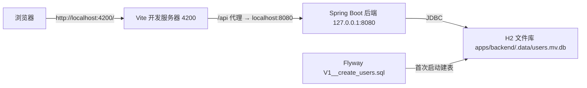

# 本地开发与数据库

本页覆盖**本地运行切片**的操作边界：环境准备、前后端启动、本地 HTTP 端点、H2 文件库的检查与重置，以及 Spring profile 和监听地址的边界。当前应用切片只有「用户 ID + displayName」的本地 CRUD 和一张前端导航页；`local` profile、`127.0.0.1` 回环监听与 H2 文件库都是**本地开发配置，不是生产方案**。生产数据库、可信身份与权限仍无依据，不得用代理、隧道或监听地址变更把本地 CRUD 暴露公网。

本地运行拓扑：



上图为本地开发拓扑：浏览器访问 Vite 静态页面；`/api` 请求由开发代理转发到绑定回环地址的后端；后端经 JDBC 读写 H2 文件库，首次启动由 Flyway 建表。

## 环境准备

在仓库根操作。需要 Node.js 24 LTS、npm 10+、Python 3.10+ 和 JDK 17；真实依赖以锁文件、[根构建](../../build.gradle)与 [Gradle Wrapper 配置](../../gradle/wrapper/gradle-wrapper.properties)为准。Python 校验器还依赖各 Skill 的 requirements.txt，不能把解释器版本符合当成依赖齐备。

```bash
node --version
npm --version
python3 --version
java -version
./gradlew --version
npm ci
```

`npm ci` 依据锁文件重建 node_modules，需要可用的包仓库；无需重复安装时不要重跑。Gradle 统一使用根 Wrapper 下载并缓存配置版本，不另装 app 内 Wrapper，也不使用 mavenLocal 代替可复现依赖来源。

## 启动前后端

```bash
# 仓库根；持续运行，Ctrl-C 停止
npm run dev

# 或分两个终端
npm run dev:backend
npm run dev:frontend
```

[根 package.json](../../package.json) 把三个脚本映射到 Nx：

- `dev` = `nx run-many --target=serve --projects=@evidence-poc/frontend,backend --parallel=2`；
- `dev:backend` = `nx serve backend`；
- `dev:frontend` = `nx serve @evidence-poc/frontend`。

后端 Nx `serve` 目标在 [apps/backend/project.json](../../apps/backend/project.json) 中声明为持续运行的 `./gradlew :backend:bootRun --console=plain`，因此 `npm run dev:backend` 与直接运行根 Wrapper `./gradlew :backend:bootRun` 等价。前端没有 `project.json`，其 `serve`/`build`/`test`/`preview` 目标由 [nx.json](../../nx.json) 中 `@nx/vite` 与 `@nx/vitest` 插件从 `vite.config.mts` 推断。

预期入口：

- 前端 `http://localhost:4200/`，显示用户 API 导航页；
- 后端 `http://127.0.0.1:8080/api/`，返回含 `users` 关系的 Root 表示；
- 健康 `http://127.0.0.1:8080/actuator/health`，只是基础运行检查，不代表业务已验收。

[apps/frontend/vite.config.mts](../../apps/frontend/vite.config.mts) 规定开发服务器 `port: 4200`、`host: 'localhost'`，并把 `/api` 前缀代理到 `http://localhost:8080`（`changeOrigin: true`）。这个 `/api` 代理是**开发期便利**，不是生产反向代理；`preview` 端口 4300 **没有配置相同的 `/api` 代理**，不能假定静态预览等于完整联调。

## 本地 HTTP 端点

先启动后端，再按 [用户 HTTP 契约](../../apps/backend/README.md) 访问。以下只读请求不改变本地资料：

```bash
curl -i http://127.0.0.1:8080/api/
curl -i http://127.0.0.1:8080/actuator/health
curl -i 'http://127.0.0.1:8080/api/users?page=0&size=20'
```

CRUD 契约：`GET /api/` 返回 Root；`POST /api/users` 创建；`GET /api/users?page=0&size=20` 分页列表（`page ≥ 0`、`size 1..100`）；`GET /api/users/{id}` 查单条；`PUT /api/users/{id}` 覆盖显示名称；`DELETE /api/users/{id}` 返回 204。支持 `application/json`、`application/hal+json` 与 `application/prs.hal-forms+json`。创建/修改/删除会**写入本地资料**，只在需要这些操作的任务中执行；非法请求为 400，缺失成员为 404，失败不修改数据。写操作参与外层本地事务并可回滚。

## Spring profile 与监听边界

[application.properties](../../apps/backend/src/main/resources/application.properties) 设置 `spring.profiles.default=local`、`spring.jersey.application-path=/api`、`spring.jackson.deserialization.fail-on-unknown-properties=true`，并显式 `spring.h2.console.enabled=false`。因此默认启动就是 `local` profile，且不开启 H2 Web Console，也没有已配置的 TCP 数据库服务器。

[application-local.properties](../../apps/backend/src/main/resources/application-local.properties) 只做两件事：

- `server.address=127.0.0.1`，把后端绑定到**回环地址**；
- `spring.datasource.url=jdbc:h2:file:./.data/users;DB_CLOSE_ON_EXIT=FALSE`，用户 `sa`、空密码。

`sa` 空密码是本地示例配置，不可用于生产。

profile 边界由 [JerseyConfiguration](../../apps/backend/src/main/java/com/evidencepoc/backend/config/JerseyConfiguration.java) 强制：仅当 `environment.matchesProfiles("local", "test")` 时才注册 `RootApi` 与三个用户异常映射器；`production` profile 不注册用户 CRUD，也不创建其资源 Bean。也就是说，本地 CRUD 是**仅 local/test 存在的开发能力**，不是未认证的生产端点。`JacksonConfiguration` 另开启 `FAIL_ON_TRAILING_TOKENS` 并禁止把 Integer/Float/Boolean 隐式强制成文本，配合未知属性拒绝，保证严格解析请求 JSON。

## H2 文件库：位置、迁移与重启

`bootRun` 的工作目录是 `apps/backend`，因此 `application-local.properties` 里的相对路径 `./.data/users` 通常落在 `apps/backend/.data/users.mv.db`；直接运行 jar 时按实际进程 cwd 计算相对路径。`DB_CLOSE_ON_EXIT=FALSE` 让 JVM 退出后仍保留文件，正常重启**保留数据**。

首次启动由 Flyway 执行 [V1\_\_create_users.sql](../../libs/backend/persistent/src/main/resources/db/migration/V1__create_users.sql) 建表：

```sql
CREATE TABLE app_users (
    id VARCHAR(36) PRIMARY KEY,
    display_name VARCHAR(100) NOT NULL,
    constraint APP_USERS_DISPLAY_NAME_NOT_EMPTY CHECK (
        CHAR_LENGTH(TRIM(display_name)) > 0
    )
);
```

测试不连本地文件库：app 与 persistent 的测试资源都使用内存库 `jdbc:h2:mem:users-${random.uuid};DB_CLOSE_DELAY=-1` 并绑定 `127.0.0.1`，测试之间彼此隔离。H2 测试不证明生产方言、隔离级别或并发模型。

## 检查与重置本地资料

H2 文件是嵌入式文件库，**同一时刻只能由一个进程使用**。用 JDBC 客户端只读检查时：

1. 有序停止正在使用该 H2 文件的后端和其他客户端，避免文件锁争用；
2. 使用与 Gradle 实际解析版本一致的 H2 JDBC 驱动，可先在仓库根运行 `./gradlew :backend:dependencyInsight --dependency h2 --configuration runtimeClasspath` 确认版本；
3. 在已安装的 JDBC 客户端中使用 URL：`jdbc:h2:file:/绝对仓库路径/apps/backend/.data/users;IFEXISTS=TRUE;ACCESS_MODE_DATA=r`。必须用绝对路径且不追加 `.mv.db`，避免工作目录错误或自动创建空库；
4. 用户 `sa`、空密码，执行只读查询，例如 `SELECT id, display_name FROM app_users ORDER BY id`；
5. 关闭连接后再启动后端。客户端或驱动未安装时明确记录环境缺口，不承诺命令可直接运行。

不要通过启用 H2 控制台或 TCP 服务绕过文件锁，也不要经直接 SQL 写入绕过领域契约；创建/修改/删除应走 HTTP 接口，保留领域校验与事务入口。

备份前先停止所有使用该库的进程，核对实际 cwd 与数据库文件，把文件复制到用户指定的安全位置。重置会**永久删除本地资料**，只在单独明确授权并确认备份后操作指定文件；不提供默认执行的删除命令，不触及其他数据库或业务证据。

## 常见故障定位

| 现象                         | 检查                                                                                           |
| ---------------------------- | ---------------------------------------------------------------------------------------------- |
| Java 编译或 Wrapper 启动失败 | JDK 17、Wrapper 下载、Maven 仓库与实际错误；记录为环境问题                                     |
| 端口占用                     | `lsof -nP -iTCP:8080 -sTCP:LISTEN` 或 4200；识别进程后再决定，不自动杀其他服务                 |
| 前端 `/api` 失败             | 后端是否启动，直连 curl 是否成功，Vite 代理目标与实际监听地址是否匹配                          |
| H2 文件锁                    | 是否有后端或另一个 JDBC 进程占用同一文件；先有序停止，不删除锁/数据绕过                        |
| Nx 目标或缓存异常            | 读取 Nx 输出与 backend project.json；用根 Wrapper 的精确模块命令定位，不能把缓存命中当全新执行 |

运行结果、端口与环境限制进入本次 CHECK 证据；完整质量入口见 [测试指南](../../docs/engineering/testing.md)，分层测试边界见 [后端模块化单体架构](../architecture/backend.md)，前端代理与导航边界见 [前端导航应用架构](../architecture/frontend.md)。

## 相关页面

- [后端模块化单体架构](../architecture/backend.md)：后端技术分层、请求路径与分层测试。
- [前端导航应用架构](../architecture/frontend.md)：前端入口、路由与 Vite 开发代理。
- [验证关卡](verification.md)：`npm test`、`./gradlew check` 等质量门的覆盖与证据纪律。
- [快速开始](../quickstart.md)：仓库与两套系统的整体导航入口。
