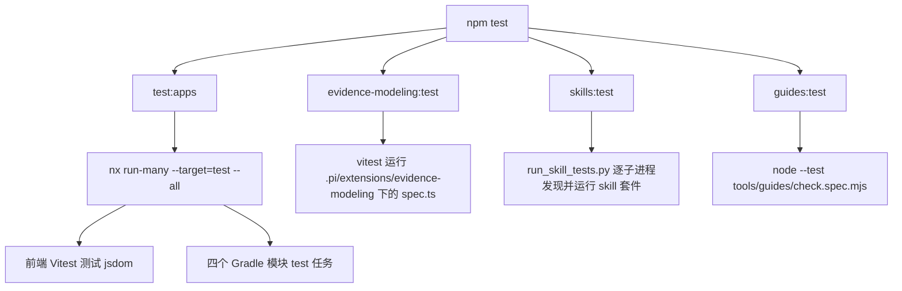

# 验证关卡

本页枚举仓库的质量门：每个命令实际跑什么、证明什么、**不**证明什么，以及执行后如何记录证据。核心纪律来自[项目宪法](../../AGENTS.md)与[测试指南](../../docs/engineering/testing.md)：**声明一条命令不等于它已经执行并通过**；只有相关 CHECK 和项目质量检查的**本次实际结果**通过，才能声称完成。环境失败、历史结果、缓存命中与业务批准必须分开说明，历史通过不能当作当前证明。

## 验证底线

[AGENTS.md](../../AGENTS.md) 的验证底线规定，仓库根需运行：

- `npm test`、`npm run lint`、`npm run build`；
- 涉及 Java 还需 `./gradlew check`；
- 前馈文档与路由需 `npm run guides:verify`。

完整覆盖、环境依赖与证据规则以 [package.json](../../package.json)、根 [build.gradle](../../build.gradle) 和[测试指南](../../docs/engineering/testing.md)为准；下表是概览，不是执行结果。

| 命令                               | 实际覆盖                                                                           | 不证明什么                                                |
| ---------------------------------- | ---------------------------------------------------------------------------------- | --------------------------------------------------------- |
| `npm test`                         | `test:apps`（Nx 全项目 test）、建模扩展 vitest、Skills 聚合回归、Guides 检查器回归 | 具体 suite、缓存与环境以输出为准；不证明生产环境          |
| `npm run lint`                     | 前端 ESLint + `guides:check`（链接/架构检查 + 指定文件 prettier）                  | 不检查 Java 格式或业务授权                                |
| `npm run build`                    | Nx 全项目 build + 建模扩展 tsc 类型检查                                            | 打包成功不等于运行验收                                    |
| `./gradlew check`                  | 四个 Gradle 模块的 Java test + Spotless 格式检查                                   | 不证明生产数据库、真实支付机构或业务批准                  |
| `npm run guides:verify`            | Guides 检查器回归、维护范围内 Markdown 本地内联链接与过期架构表述、前馈文件格式    | 不检查外部 URL 可达性、标题锚点或业务语义；不证明任务就绪 |
| `npm run evidence-modeling:verify` | 建模扩展类型、测试及其配置的格式范围                                               | 不替代产品 HTTP/SQL 检查                                  |
| `npm run skills:verify`            | 各 Skill `tests/` 与 `tests/portability/` 聚合回归                                 | 不调用语言模型；输入准备不等于生成评测通过                |

## `npm test` 的组成

`npm test` 是四个子检查的串联，任何一个非零退出都会让整体失败：

上图为 `npm test` 的命令组合：`test:apps` 由 Nx 分发到前端 Vitest 与四个 Gradle 模块；另外三条分别覆盖建模扩展、Skill 套件和 Guides 检查器自身回归。

具体拆分来自 [package.json](../../package.json)：

- `test:apps` = `nx run-many --target=test --all`。`@nx/vitest` 插件为前端提供 `test` 目标，`@nx/gradle` 插件为 `:backend`、`:backend-domain`、`:backend-api`、`:backend-persistent` 推断出 `test` 目标，因此这一步运行前端与全部后端模块的测试任务。
- `evidence-modeling:test` = `vitest run --config .pi/extensions/evidence-modeling/evidence-modeling.vitest.config.mts`，只收集 `.pi/extensions/evidence-modeling/**/*.spec.ts`，环境为 `node`。
- `skills:test` = `python3 .agents/skills/evidence-modeling/tests/run_skill_tests.py`，逐套件聚合运行所有 Skill 测试。
- `guides:test` = `node --test tools/guides/check.spec.mjs`，检查链接检查器自身的行为回归。

注意 `npm test` 运行的是各模块的 Gradle `test` 任务，**不运行 Spotless**；Java 格式检查要走 `./gradlew check`。`npm test` 覆盖的是测试套件，不直接证明生产环境行为。

## `npm run lint`

`npm run lint` = `nx lint @evidence-poc/frontend && npm run guides:check`（见 [package.json](../../package.json)）。

- 前半段只对前端运行 ESLint（Nx flat config，叠加 React 规则）；Java 代码不在这个关卡内，格式由 Spotless 负责。
- 后半段 `guides:check` 再拆两步：先运行链接/架构检查器 `node tools/guides/check.mjs`，再用 `prettier --check` 检查 `AGENTS.md`、`README.md`、`docs/**/*.md`、`apps/backend/README.md`、`.evidence/README.md`、`.evidence/api/README.md`、`.agents/skills/README.md`、planning/delivery 的 `.md/.json` 以及 `tools/guides/*.mjs`。

[.pi/extensions/evidence-modeling](../../.pi/extensions/evidence-modeling/) 的 TypeScript 不进入这个 ESLint 关卡，它由 `evidence-modeling:typecheck`、`evidence-modeling:test` 和 `evidence-modeling:format:check` 分别约束。

## `npm run build`

`npm run build` = `npm run build:apps && npm run evidence-modeling:typecheck`。

- `build:apps` = `nx run-many --target=build --all`：前端执行 Vite 构建；Gradle 项目执行各自的 `build` 任务。Gradle 的 `build` 生命周期包含 `check`，因此后端模块的 build 也连带运行 test 与 `spotlessCheck`。
- `evidence-modeling:typecheck` = `tsc -p .pi/extensions/evidence-modeling/tsconfig.json`，`noEmit` 只做类型检查。

构建成功只说明可编译/可打包，不代表运行验收通过；业务行为仍需对应测试与验收 CHECK 证明。

## `./gradlew check` 与分层测试

[根 build.gradle](../../build.gradle) 对所有子项目应用 Java 插件与 Spotless（googleJavaFormat 1.22.0、importOrder、removeUnusedImports），并让每个子项目的 `check` 依赖 `spotlessCheck`。结合 Java 插件 `check` 依赖 `test` 的默认语义，仓库根 `./gradlew check` 会对 [settings.gradle](../../settings.gradle) 中注册的 `:backend`、`:backend-domain`、`:backend-api`、`:backend-persistent` 全部执行 Java 测试与格式检查。

四个模块的测试边界如下，按改动选择精确命令比无差别全跑更有针对性：

| 层 / 工作  | 命令                                                                                | 关键依赖与预期                                                                 |
| ---------- | ----------------------------------------------------------------------------------- | ------------------------------------------------------------------------------ |
| domain     | `./gradlew :backend-domain:test`                                                    | 纯领域行为与固定边界；不证明 HTTP/SQL                                          |
| api        | `./gradlew :backend-api:test`                                                       | 真实随机端口 HTTP + mock 领域；不需要数据库，不 mock 被测 Resource/分页/序列化 |
| persistent | `./gradlew :backend-persistent:test`                                                | 真实 H2/MyBatis/XML/Flyway、行数与事务回滚                                     |
| app        | `./gradlew :backend:test`                                                           | 真实 HTTP + SQL、配置、profile 隔离及架构检查                                  |
| frontend   | `npx nx test @evidence-poc/frontend`                                                | Vitest/jsdom/Testing Library；真实浏览器另行检查                               |
| planning   | `python3 -B -m unittest discover -s .agents/skills/evidence-task-planning/tests -v` | 确定性身份、切片、依赖、覆盖、工序分支/汇合与前馈模板契约                      |
| delivery   | `python3 -B -m unittest discover -s .agents/skills/evidence-delivery/tests -v`      | 只读状态检查及执行/恢复前馈协议                                                |
| Guides     | `npm run guides:test`                                                               | 本地链接检查器的正常、缺失、模板、扫描范围、只读回归与项目工序路由/说明结构    |

app 层的 `:backend:test` 还包含 [BackendArchitectureTests](../../apps/backend/src/test/java/com/evidencepoc/backend/BackendArchitectureTests.java) 的 ArchUnit 规则：domain 不得依赖 api/persistent/config/Spring/MyBatis/JAX-RS/Jackson/smartdomain-mybatis；api 不得触达 persistent/config/MyBatis/JDBC；persistent 不得触达 api/config/JAX-RS。这些规则只证明编译期包依赖被隔离，不证明业务语义正确。Java 分层测试的 H2、mock 和随机端口证据不证明生产数据库、生产方言或真实支付机构。

## `guides:verify` 与链接检查器

`npm run guides:verify` = `npm run guides:test && npm run guides:check`，其中 `guides:test` 跑检查器回归，`guides:check` 跑实际扫描加 prettier。

[check.mjs](../../tools/guides/check.mjs) 的扫描范围是 `requiredDocuments` 加上 `documentationTrees`：九个必读文档（`AGENTS.md`、`README.md`、`docs/guides/index.md`、`apps/backend/README.md`、`.evidence/README.md`、`.evidence/api/README.md`、`.agents/skills/README.md` 以及 planning/delivery 的 `SKILL.md`），外加 `docs` 全树与 planning/delivery 的 `references`、`assets`。业务源 YAML、生成产物、历史证据、评测夹具和第三方材料不重写为前馈，也不被扫描。检查器只验证**当前维护的指南**，不是仓库全量 Markdown。

它实际检查四类问题：

- 必读文档缺失；
- 文档路径逃出项目根（包括经符号链接逃出）；
- 出现过期架构表述「分布式单体 / distributed monolith」；
- 本地内联链接指向不存在的文件、路径逃出或 URL 编码非法。

检查器会先剥离代码围栏，因此围栏里的示例路径不当作真实链接；也会跳过远程 scheme（`http:`、`mailto:`、`//` 等）、`#` 锚点、`{{...}}` 与 `${...}` 模板变量。它**不是**完整 Markdown 解析器，不检查外部 URL 可达性、标题锚点是否正确或指南的业务语义。链接可达不等于指南正确。

## `evidence-modeling:verify`

`npm run evidence-modeling:verify` = `npm run evidence-modeling:typecheck && npm run evidence-modeling:test && npm run evidence-modeling:format:check`。

- typecheck 与 test 覆盖 [.pi/extensions/evidence-modeling](../../.pi/extensions/evidence-modeling/) 的命令注册、问答 UI 与工具契约；
- `format:check` 用 prettier 检查扩展目录、`evidence-modeling`/`evidence-task-planning`/`evidence-delivery` 的 markdown/json、`evidence-fm` 的 SKILL.md/references/evals/schemas、`docs/evidence-modeling.md` 与 `README.md`。

它证明 Pi 扩展与相关前馈材料通过类型、测试和格式检查，不替代产品 HTTP/SQL 检查，也不调用语言模型验证生成质量。

## `skills:verify` 与技能套件

`npm run skills:verify` 即 `npm run skills:test`，入口是 [run_skill_tests.py](../../.agents/skills/evidence-modeling/tests/run_skill_tests.py)：它发现 `.agents/skills/` 下每个 `*/tests` 目录及可选的 `*/tests/portability`，用**独立子进程**逐个运行 `python3 -B -m unittest discover -s <suite> -v`，任何套件非零退出都会让整体失败。独立子进程是为了隔离同名测试模块，避免跨套件导入串包。

聚合范围包括 modeling 的组合/包/文档/宿主检查、`evidence-fm` 的引擎/Schema/CEL/lineage/模拟/评分回归及其 portability、`evidence-api-design` 的文档与契约、`evidence-task-planning` 的切片与编译器、`evidence-delivery` 的只读状态与前馈协议、`evidence-visualization` 的生成与 portability。另有一个独立便捷入口 `skills:test:fm` 用固定 `/opt/miniconda3/bin/python3.12` 只跑 FM 套件，不接入 `npm test`。

这些自动测试**不调用语言模型**；输入准备、结构覆盖和合成夹具编译通过，都不等于访谈质量、语义完整、具名审核或 UAT 通过。

## 缓存、环境与证据纪律

[Nx](../../nx.json) 与 [Gradle](../../gradle.properties) 都启用缓存（后者 `org.gradle.caching=true`）。因此一次运行可能命中缓存或标记 `UP-TO-DATE`，这**不是**一次新执行：

- 记录时必须把 Nx/Gradle 的缓存命中、`UP-TO-DATE`、实际执行分别说明；
- 需要复验时用 `npx nx ... --skip-nx-cache` 或 `./gradlew ... --rerun-tasks`，不能把缓存描述为新运行。

失败要区分**环境失败**（依赖缺失、端口占用、仓库不可达、解释器不满足 requirements）与**实现失败**（测试断言、编译、格式、契约违规）。环境失败记为环境阻塞，不伪装成业务失败。历史检查只有在输入、环境和依赖仍有效时才能作为有限的前置证据，不能作为当前通过。

每个任务 CHECK 至少明确：目的、被测行为、真实依赖/Fake、固定输入与业务时间、正常/边界/反例、失败不变性、测试文件、cwd、精确命令、环境准备与完成条件；命令未知填 `null` 并关联局部 gap，不写「运行相关测试」冒充可执行。实际执行后记录命令、cwd、工具/环境与运行标识、退出码、真实输出或日志路径、断言覆盖与未执行项。

任务结果写入详情 `observedEvidence`，状态只更新索引 `taskNotes`；较长输出留在获授权的 `.evidence/checks/` 运行目录。Harness 文档维护没有业务 DAG 时可以保存独立检查记录，但不能制造业务任务 done 或审核通过。不得删失败测试、改业务预期或手改机器报告制造通过。

## 相关页面

- [本地开发与数据库](local-development.md)：本地启动、端点与 H2 环境边界，以及质量入口的引用。
- 后端分层测试：后端模块化单体的 domain/api/persistent/app 测试边界。
- Harness 测试：前馈检查器与 Skill 套件的维护与回归。
- 证据交付：任务 CHECK 证据如何写入 `observedEvidence` 与 `.evidence/checks/`。
