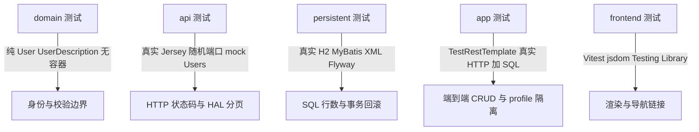

# 后端分层测试

后端是模块化单体，`apps/backend` 是组合根，`libs/backend/domain`、`libs/backend/api`、`libs/backend/persistent` 是同一应用内的技术构建库。每一层有自己独立的测试入口和测试边界，**各层证据各证其责，不能互相冒充**：领域测试通过不等于 HTTP 契约正确，API 的 mock 通过不等于 SQL 通过，H2 的 SQL 通过也不等于生产数据库或生产并发安全。

分层测试入口由 [测试指南](../../docs/engineering/testing.md) 固定，按层选择精确命令比无差别全跑更有针对性：

| 层 / 工作  | 命令                                 | 真实依赖与 Fake                                                       | 证明什么                                               | 不证明什么                               |
| ---------- | ------------------------------------ | --------------------------------------------------------------------- | ------------------------------------------------------ | ---------------------------------------- |
| domain     | `./gradlew :backend-domain:test`     | 真实 `User`/`UserDescription`，无容器                                 | 描述校验、身份稳定、失败不变性                         | 不证明 HTTP/SQL                          |
| api        | `./gradlew :backend-api:test`        | 真实随机端口 HTTP + Jersey + HAL；`@MockitoBean` 只 mock 领域 `Users` | 状态码、媒体协商、序列化、官方分页、超媒体链接与模板   | 不证明领域规则、SQL、事务                |
| persistent | `./gradlew :backend-persistent:test` | 真实 H2/MyBatis/XML/Flyway/`InjectableObjectFactory`                  | 写后重读、关联装配、参数绑定、稳定排序、行数、事务回滚 | 不证明生产方言、隔离级别、生产并发       |
| app        | `./gradlew :backend:test`            | `TestRestTemplate` 真实 HTTP + 真实 SQL + 组合根装配                  | 端到端 CRUD、配置、profile 隔离、跨模块装配、ArchUnit  | 不证明生产认证、生产数据库、真实支付机构 |
| frontend   | `npx nx test @evidence-poc/frontend` | Vitest/jsdom/Testing Library 渲染真实 `App`                           | 渲染成功、导航与 API 入口链接                          | 不证明后端授权；真实浏览器另行检查       |

上图为五类测试的隔离边界：每层只替换自己的依赖边界，下一层的证据不能替代上一层。

## 领域层：纯对象与固定边界

领域测试 [`UserTests`](../../libs/backend/domain/src/test/java/com/evidencepoc/backend/domain/UserTests.java) 不启动 Spring 容器，直接用 JUnit 构造真实的 `User` 与 `UserDescription` 并断言行为：

- `rejectsMissingOrBlankDisplayName` 拒绝 `null`、空白、制表符与 Unicode 空格（`\u2003`）。
- `boundsDisplayNameAndPreservesInput` 固定 100 字符边界，并断言输入原样保留（不裁剪 `" 小明 "`）。
- `renameKeepsStableIdentityWithoutMutatingLoadedSnapshot` 证明 `renameTo` 返回身份不变的新实例，且已加载的原快照不变。
- `requiresAnIdentityAndDescription` 证明身份为空串或描述为 `null` 时构造失败。

这一层证明的是**业务判断与不变性**，不触碰 HTTP、数据库或 Spring，因此不能推导出协议正确或数据已持久化。

## API 层：真实 HTTP + mock 领域

API 测试 [`ApiTest`](../../libs/backend/api/src/test/java/com/evidencepoc/backend/api/ApiTest.java) 基类用 `@SpringBootTest(webEnvironment=RANDOM_PORT)` 启动真实 Jersey 容器，并通过 [`ApiTestApplication`](../../libs/backend/api/src/test/java/com/evidencepoc/backend/api/config/ApiTestApplication.java) 只导入 `RootApi` 与三个异常映射器，**不引入 app/persistent 模块**。唯一被 mock 的是领域根集合 `Users`（`@MockitoBean`），且每个用例都用 Mockito 校验交互并调用 `verifyNoMoreInteractions`/`verifyNoInteractions`。

这一层证明的协议边界包括：

- [`UserApiTests`](../../libs/backend/api/src/test/java/com/evidencepoc/backend/api/UserApiTests.java)：GET 媒体协商与已加载实体表示；缺失成员对 GET/PUT/DELETE 统一返回 404 `USER_NOT_FOUND` 且不调用任何写方法；PUT 委托稳定身份与新描述且原快照不变；DELETE 返回 204；非法描述返回 400 `INVALID_DISPLAY_NAME` 且不写；查找后成员消失仍映射为 404。
- [`UsersApiTests`](../../libs/backend/api/src/test/java/com/evidencepoc/backend/api/UsersApiTests.java)：创建返回 201、Location 与可寻址表示；分页链接可跟随且边界页为 404；空集合保留默认分页与可写 create affordance；非法分页参数不调用领域；非法 JSON/未知字段/类型错误不调用领域。
- [`RootApiTests`](../../libs/backend/api/src/test/java/com/evidencepoc/backend/api/RootApiTests.java) 的 `apiCompositionDoesNotStartPersistence` 直接断言上下文里 `DataSource` Bean 数量为 0、不存在 `sqlSessionFactory`，把「API 层不依赖持久化」从设计约束变成可执行断言。
- [`ApiTemplatesTests`](../../libs/backend/api/src/test/java/com/evidencepoc/backend/api/ApiTemplatesTests.java) 单独验证 URI 生成：绝对 URI 保留 servlet 前缀、成员身份编码、相对链接保留编码并去掉 fragment。

关键纪律是**不 mock 被测的 Resource、序列化器或分页**：`UsersApiTests.paginationUsesManySlicesAndItsLinksAreFollowable` 用 spy 的 [`TestMany`](../../libs/backend/api/src/test/java/com/evidencepoc/backend/api/TestMany.java) 实现真实 `Many` 切片语义，断言 `subCollection(0,2)`/`(2,3)` 被调用且 `iterator()` 从未被调用，分页决策仍留在被测的 smart-domain `Pagination` 组件内。

## 持久化层：真实 H2/MyBatis/XML/Flyway

持久化测试 [`MyBatisUsersTests`](../../libs/backend/persistent/src/test/java/com/evidencepoc/backend/persistent/MyBatisUsersTests.java) 用 `@SpringBootTest(webEnvironment=NONE)` 启动 persistent 模块自身的测试应用（`@ComponentScan("com.evidencepoc.backend.persistent")`），接入真实的内存库与 MyBatis 装配。测试 profile 用 [`application-test.properties`](../../libs/backend/persistent/src/test/resources/application-test.properties) 的 `jdbc:h2:mem:users-${random.uuid};DB_CLOSE_DELAY=-1`，每个用例前 `DELETE FROM app_users` 清理，不连本地文件库。

该层证明的是**数据归属与真实 SQL/事务**：

- `realSqlRoundTripPreservesIdentityAndDoesNotMergeEqualNames` 证明 `Users` 适配器生成的 UUID 身份、写后重读、同名不合并、更新与删除后行数。
- `paginationHasStableOrderAndBoundedPages` 证明 `findAll().subCollection(...)` 按 id 稳定排序，越界页返回空集合。
- `absentUpdateAndDeleteDoNotCreateAUser` 证明缺失成员的 update/delete 抛 `UserNotFoundException` 且不新增行。
- `namesAndIdentityQueriesAreBoundParameters` 用 SQL 注入样式的输入证明参数绑定，不执行注入。
- `allWritesParticipateInTheLocalTransactionAndRollback` 用 `TransactionTemplate` 证明 create/update/delete 参与同一本地事务，异常后全部回滚。
- `startersAndFlywayAreActuallyLoaded` 断言 `genericEntityHydrator`、`injectableObjectFactory`、`HydratingCacheManager` 已加载，`SqlSessionFactory` 使用 `InjectableObjectFactory`，且 `flyway_schema_history` 中版本 `1` 成功记录。

H2 证据只证明当前 XML/SQL 与事务机制，不证明生产数据库方言、隔离级别或生产并发安全。

## 应用层：真实装配与端到端链路

应用层测试位于 [`apps/backend/src/test/java/com/evidencepoc/backend/`](../../apps/backend/src/test/java/com/evidencepoc/backend/)，在 test profile 下装配完整组合根，从真实 HTTP 进入并落到真实 SQL：

- [`UserApiTests`](../../apps/backend/src/test/java/com/evidencepoc/backend/user/UserApiTests.java) 用 `TestRestTemplate` 走 RANDOM_PORT，覆盖创建→读取→修改→删除→再读 404 的完整 CRUD、Location 与稳定身份、集合空页/创建 affordance/分页导航、非法创建不写库（`SELECT COUNT(*)` 为 0）、非法更新不修改且长度边界生效、非法分页、三种媒体协商、actuator 健康检查与 root 导航。
- [`BackendApplicationTests`](../../apps/backend/src/test/java/com/evidencepoc/backend/BackendApplicationTests.java) 断言跨模块 starter（`genericEntityHydrator`、`smartDomainApiJerseyCustomizer`、`halFormsConfiguration`）在组合根真实装配，而不是只断言 Bean 存在。
- [`UserExposureTests`](../../apps/backend/src/test/java/com/evidencepoc/backend/user/UserExposureTests.java) 用 `production` profile 验证 `JerseyConfiguration` 不注册 `RootApi`，且刷新上下文后 `RootApi` Bean 数量为 0，把「CRUD 只在 local/test 暴露」固化为测试。

这一层把「接线正确、失败不写、profile 隔离」连成一条真实链路；它不证明生产认证或生产环境授权。

## 前端层：Vitest/jsdom 渲染真实组件

前端测试 [`app.spec.tsx`](../../apps/frontend/src/app/app.spec.tsx) 在 [Vitest 配置](../../apps/frontend/vite.config.mts) 的 `jsdom` 环境下用 Testing Library 渲染真实 [`App`](../../apps/frontend/src/app/app.tsx) 组件（包在 `BrowserRouter` 里），断言渲染成功、`用户资料` 标题存在、`查看用户 API` 链接的 `href` 指向 `/api/users`。

它只证明**当前导航页**的用户可观察行为；按钮或链接可见不证明后端授权，真实浏览器行为另行按 [浏览器调试 howto](../../docs/howtos/browser-debugging.md) 检查。

## ArchUnit 层规则

[`BackendArchitectureTests`](../../apps/backend/src/test/java/com/evidencepoc/backend/BackendArchitectureTests.java) 把编译期依赖隔离固化为 ArchUnit 规则（`DoNotIncludeTests`）：

- `domainIsIndependent`：`..domain..` 不得依赖 `..api..`、`..persistent..`、`..config..`、Spring、MyBatis、JAX-RS、Jackson、`smartdomain.mybatis`。
- `apiDoesNotReachPersistence`：`..api..` 不得触达 `..persistent..`、`..config..`、MyBatis、Spring JDBC。
- `persistenceDoesNotReachHttp`：`..persistent..` 不得触达 `com.evidencepoc.backend.api..`、`com.evidencepoc.backend.config..`、JAX-RS。

这些规则只证明包依赖被隔离，不证明业务语义正确；它们随 `./gradlew :backend:test` 运行。

## 证据不可互换

各层测试不是同一条证据的不同写法，而是各自独立的可证伪命题：

- 领域规则正确（`UserTests`）不证明 HTTP 会正确翻译状态码与 HAL（需要 `UserApiTests`/`UsersApiTests`）。
- API 的 mock 通过不证明 SQL 或事务正确（需要 `MyBatisUsersTests`）。
- H2/MyBatis 的 SQL 通过不证明组合根装配、真实 HTTP 入口或 profile 隔离（需要应用层 `UserApiTests`/`UserExposureTests`）。
- 前端渲染通过不证明后端授权或真实浏览器行为。

按 [测试工序](../../docs/engineering/procedures.md) 选择工序时，领域、独立 HTTP、SQL 与真实装配证据必须分别取得，不能拿其中一层冒充另一层。执行后还要区分缓存命中/`UP-TO-DATE` 与真实新运行，需要复验时用 `./gradlew ... --rerun-tasks` 或 `npx nx ... --skip-nx-cache`，不能把缓存描述为新运行。

## 相关页面

- [后端模块化单体架构](../architecture/backend.md)：技术分层与 HTTP → Jersey → 领域 → MyBatis → H2 请求路径。
- [FM 到实现映射](../concepts/domain-mapping.md)：业务规则归属与分层测试分工。
- [验证关卡](../operations/verification.md)：仓库根质量门与缓存/证据纪律。
- Harness 测试（[harness-tests.md](harness-tests.md)）：前馈检查器与 Skill 套件的维护回归，不在本页范围内。
