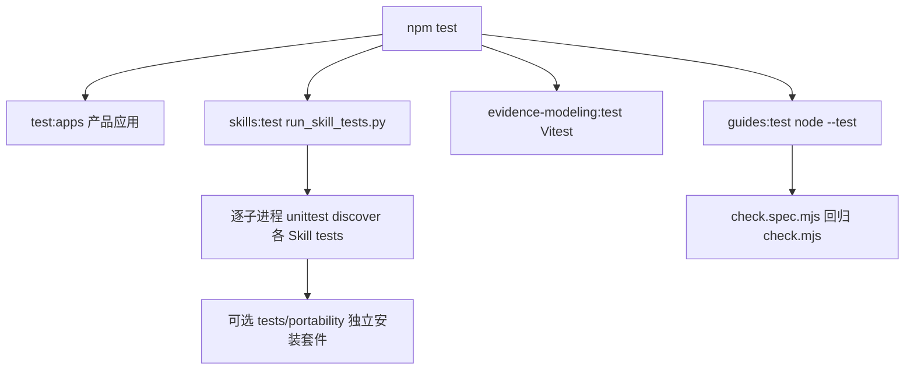

# Harness 与 Skill 测试

本页只覆盖 **Evidence Harness 自身的维护回归**：`.agents/skills/` 里各 evidence-\* Skill 的 Python 套件、`.pi/extensions/evidence-modeling/` 建模扩展的 Vitest 测试、`tools/guides/` 前馈检查器的 `node --test` 回归，以及 `evals/` 人工行为评测的角色。产品软件的分层测试（domain/api/persistent/app/frontend）见[后端分层测试](backend-layers.md)，不在这里重复。

核心边界是一条纪律：**自动回归与人工评测分开，评测和测试都不是业务来源**。合成夹具、评测输入和 Skill 文档检查都是维护材料，不向 `.evidence/` 或 `docs/` 提供任何业务事实；没有执行的评测不能记为通过，机器结果不等于访谈质量、语义完整、具名审核或 UAT。

## 入口与聚合

仓库根的四个脚本分别对应四类入口（见 [`package.json`](../../package.json)）：

| 入口                            | 实际命令                                                                                   | 覆盖对象                         |
| ------------------------------- | ------------------------------------------------------------------------------------------ | -------------------------------- |
| `skills:test` / `skills:verify` | `python3 .agents/skills/evidence-modeling/tests/run_skill_tests.py`                        | 各 Skill 的 Python unittest 套件 |
| `evidence-modeling:test`        | `vitest run --config .pi/extensions/evidence-modeling/evidence-modeling.vitest.config.mts` | Pi 建模扩展的 `*.spec.ts`        |
| `guides:test`                   | `node --test tools/guides/check.spec.mjs`                                                  | Guides 链接检查器自身回归        |
| `npm test`                      | `test:apps` + 上三条                                                                       | 产品应用测试 + 全部 Harness 回归 |

`npm test` 是四段串联，任何一段非零退出都使整体失败；其中 `test:apps` 属于产品应用（Nx 分发到前端 Vitest 与四个 Gradle 模块 test），其余三段才是 Harness 自身。`skills:verify` 就是 `skills:test`，`guides:verify` 是 `guides:test` + 真实扫描 `guides:check`。



上图为 `npm test` 中 Harness 相关三段的装配：Skill 套件由聚合脚本逐子进程运行，建模扩展与 Guides 检查器各自独立回归。

## Skill 套件聚合器

[`run_skill_tests.py`](../../.agents/skills/evidence-modeling/tests/run_skill_tests.py) 是 Skill 测试的唯一聚合入口。它从 `.agents/skills/` 下发现每个 `*/tests` 目录，以及可选存在的 `*/tests/portability` 子目录，然后用**独立子进程**逐个执行：

```text
<sys.executable> -B -m unittest discover -s <suite> -v
```

独立解释器是为了隔离同名测试模块，避免跨套件导入串包；任何套件非零退出都会把整体结果置为非零。`tests/portability/` 特意不设 `__init__.py`：安装副本的顶层回归不会递归执行安装测试，但聚合入口显式运行它们，不能漏跑。发现不到任何套件时返回 1，不是成功。

聚合范围由 [`test_suite_runner.py`](../../.agents/skills/evidence-modeling/tests/test_suite_runner.py) 固定为八套：`evidence-fm/tests` 与 `evidence-fm/tests/portability`、`evidence-visualization/tests` 与 `evidence-visualization/tests/portability`、`evidence-api-design/tests`、`evidence-modeling/tests`、`evidence-delivery/tests`、`evidence-task-planning/tests`。该套件同时断言每个 `portability` 目录不含 `__init__.py`、每套用同一解释器、失败不被吞掉、空套件不等于成功。

## FM 套件：引擎、Schema、CEL、lineage、模拟与评分

[`evidence-fm/tests/`](../../.agents/skills/evidence-fm/tests/) 从自身位置加载包内 `scripts`、`schemas`、`evals`，不依赖原仓库布局或调用目录。合成输入由 [`context_samples.py`](../../.agents/skills/evidence-fm/tests/context_samples.py) 与 `fixtures/` 提供，明确标注为合成数据，不是真实业务默认值；测试使用临时模型，不覆盖业务源文件。

覆盖范围包括：业务属性命名、六类凭证时间（`rfp`/`proposal`/`fulfillment_request` 用 `started_at`+`expired_at`、`contract` 用 `signed_at`、`fulfillment_confirmation` 用 `confirmed_at`、`other_evidence` 用 `created_at`，见 [`test_evidence_times.py`](../../.agents/skills/evidence-fm/tests/test_evidence_times.py)）、领域/合同前/混合上下文、CEL、追溯、编译、单据模拟以及评分器正反例；[`test_scope_evals.py`](../../.agents/skills/evidence-fm/tests/test_scope_evals.py) 用 `run_modeling_evals.py` 的 `grade` 函数对合成模型跑评分预期。

[`tests/portability/test_isolated_fm.py`](../../.agents/skills/evidence-fm/tests/portability/test_isolated_fm.py) 把整个 FM 包复制到无仓库依赖、含空格路径，验证：删除 `tests/` 与 `evals/` 后纯领域检查与付款模拟仍可运行（`check_fm.py` 输出 JSON 且不改写源文件，`simulationPassed` 在无场景时为 `null`）；包内回归和评测准备在不相关 cwd 下也能跑；源文件哈希在执行前后不变。

## API 套件：单一 API 输入与整体 HTTP 契约

[`evidence-api-design/tests/`](../../.agents/skills/evidence-api-design/tests/) 围绕 [`fm_api.py`](../../.agents/skills/evidence-api-design/scripts/fm_api.py) 的 `check`/`project` 与 `fm_api_core` 模块展开，输入都是合成 transport 样例，不构成额外业务权限或 FM 事实：

- [`test_api_document.py`](../../.agents/skills/evidence-api-design/tests/test_api_document.py)：单一 API 文档拥有完整接口与 HTTP 设计；`http` 缺失被拒且不写输出；`api.yaml` 不得位于 FM 根内（`API_INPUT_CONFLICT`）；命令面只有一个 `--api` 输入；`api.yaml` 变更使整个投影失效。
- [`test_business_resources.py`](../../.agents/skills/evidence-api-design/tests/test_business_resources.py)：资源形状（singleton/collection）、数量方向与父子作用域、基数量冲突与未决缺口、来源声明不得覆盖既有 FM 数量。
- [`test_contracts.py`](../../.agents/skills/evidence-api-design/tests/test_contracts.py)：整体 HTTP 契约的表示、操作、幂等、并发与旅程；[`test_openapi.py`](../../.agents/skills/evidence-api-design/tests/test_openapi.py)、[`test_hypermedia.py`](../../.agents/skills/evidence-api-design/tests/test_hypermedia.py)、[`test_whole_model.py`](../../.agents/skills/evidence-api-design/tests/test_whole_model.py)、[`test_evidence_prerequisites.py`](../../.agents/skills/evidence-api-design/tests/test_evidence_prerequisites.py) 补齐投影、超媒体与前提校验。

## 规划套件：确定性编译与工序切片

[`evidence-task-planning/tests/test_task_compiler.py`](../../.agents/skills/evidence-task-planning/tests/test_task_compiler.py) 直接 `importlib` 加载 [`task_compiler.py`](../../.agents/skills/evidence-task-planning/scripts/task_compiler.py)，验证 `inventory`/`compile` 是确定性、只读的计算投影，不生成业务代码也不写计划文件：

- 平台单元与固定 profile 强一致：`profile.backend-modules` 是强制平台工作，`modular-monolith` 架构工作不可用 `external`/`not-applicable` 排除，profile 覆盖被拒（`profile is fixed`）。
- 身份稳定：`taskKey = encode(concern) :: encode(ownerRef) :: encode(operationRef)`，键和路径不依赖成员顺序、文件移动或标签改名；重复 YAML 键、重复 ID、未知 FM 引用被拒，`generated/` 不是来源。
- 依赖与覆盖：source cycles 不是 execution cycles；执行依赖环被拒；部分映射报 `coverageComplete: false` 与 `unassignedUnitKeys`；工序 fanout 让规则被唯一拥有、SQL/HTTP 分支在验收汇合，`apiCoverage` 记录交付任务与支撑任务。
- 文件名是必填且严格可移植：拒绝空值、路径穿越、分隔符、控制/隐藏字符、Windows 保留名、组合字符、超长（>197 字符 + `.md`）与跨任务大小写/Unicode 等价重名；安全 YAML 拒绝 Python 标签。

[`test_guides_contract.py`](../../.agents/skills/evidence-task-planning/tests/test_guides_contract.py) 回归模板与协议结构：任务/索引模板各只有一个 YAML 块，详情只有 `planRef`/`procedureRefs`/`observedEvidence` 不复制 `status`/`dependsOn`/`guidesReady`，索引的 `sourceManifest`/`taskNotes` 为空、`compiled` 为 `null`；工序选择先于分组且不扩展 Schema（无 `procedureId`/`procedureStatus`），协议不硬编码消费者项目路径或领域标识。

## 交付套件：只读状态检查与双层循环协议

[`evidence-delivery/tests/test_plan_state.py`](../../.agents/skills/evidence-delivery/tests/test_plan_state.py) 直接加载 [`plan_state.py`](../../.agents/skills/evidence-delivery/scripts/plan_state.py)，用临时索引与任务文件断言 `inspect_plan`/`next` 的判定：

- 只读：`inspect_plan` 前后所有 `.md` 字节不变，`sourceFreshness` 含 `not-checked`。
- 候选：首个 planned 任务可运行；done 依赖完成后下一个任务可运行；未知 mode 被拒且不选任务；active 任务要求依赖已完成；blocked 或空命令必须引用已知 gap。
- 一致性：`taskNotes` 与详情 CHECK id 一一对应；done 必须有 completionCriteria 与 observed evidence；`executionOrder` 必须符合依赖。
- CLI：`next` 输出 JSON，无效计划返回非零并列出 diagnostics。

[`test_guides_contract.py`](../../.agents/skills/evidence-delivery/tests/test_guides_contract.py) 回归交付协议文本结构：Guides 门在 Action 之前、保留单一 `taskNotes` 状态、FM/API 摘要不覆盖工程指南、`next` 只判断结构候选；恢复会话先重新加载工程来源并在 Action 前核对 `procedureRefs`。

## 建模扩展：Vitest 固定交互边界

[`evidence-modeling.vitest.config.mts`](../../.pi/extensions/evidence-modeling/evidence-modeling.vitest.config.mts) 在 `node` 环境下只收集 `.pi/extensions/evidence-modeling/**/*.spec.ts`。三个 spec 分别固定扩展的三个边界：

- [`index.spec.ts`](../../.pi/extensions/evidence-modeling/index.spec.ts)：扩展只注册 `evidence-model` 命令与 `evidence_ui_question` 工具，不注册事件钩子；源码不含 `agent_settled`、`tool_call`、`ToolLease`、`StateStore`，不写 `.evidence/evidence-modeling`，不含 `writeFile`/`appendEntry`/`apply_candidate`/`pi.exec`，不从 `evidence/` 目录导入。
- [`commands.spec.ts`](../../.pi/extensions/evidence-modeling/commands.spec.ts)：带参转发为 `/skill:evidence-modeling <目标>` 且 `expandPromptTemplates: true`；无参菜单映射三种意图（讨论业务不修改模型、生成或修改模型直接编辑并校验、只校验模型只读），返回/关闭/空白目标不发送消息，缺少 Skill 只提示资源问题。
- [`question-ui.spec.ts`](../../.pi/extensions/evidence-modeling/question-ui.spec.ts)：多行回答原样保留，各动作映射为 `answered`/`deferred`/`stopped`/`cancelled`，空白提交不算回答，无 UI 返回 `unavailable`，宿主抛异常后释放面板，同一进程只允许一个面板。

[`evidence-modeling/tests/`](../../.agents/skills/evidence-modeling/tests/) 自身还跨包检查：`test_skill_packages.py` 验证每个可移植 Skill 的 frontmatter 与 SKILL.md 入口边界、单包复制后链接闭合、`evidence-modeling` 是显式组合入口、八个目录共用 `evidence-` 命名空间；`test_fm_integration.py` 验证扩展只注册一个命令一个工具、`package.json` 脚本目标存在、组合文档只使用当前 FM Schema；`test_skill_documentation.py` 验证 discovery 拥有访谈而 FM 拥有建模知识、直接编辑授权与业务批准分离、业务文档链接不反向拉入维护材料。

## Guides 检查器：node --test 回归

[`check.spec.mjs`](../../tools/guides/check.spec.mjs) 用 `node --test` 直接回归 [`check.mjs`](../../tools/guides/check.mjs) 的 `collectDocuments` 与 `checkDocuments`，先构造临时目录做单元断言，再读真实前馈文档做项目结构断言：

- 项目工序路由：`docs/guides/index.md` 中「任务规划」行指向 `../engineering/procedures.md`，`docs/engineering/testing.md` 引用 `(procedures.md)`，七个工序小节各含「触发与输入 / 粒度与产物 / 测试边界与退出 / 前置与转向」四个字段，且引用 `(testing.md)`、`(examples.md)`、`../architecture/modules.md`。
- 路径解析：相对文件、目录、百分号编码名、尖括号路径与标题都能解析，且检查不写回文档；非法编码、越出项目根分别报错。
- 扫描边界：忽略围栏、远程链接、本地锚点、`{{path}}`/`${ROOT}` 模板变量；缺失必读文档与缺失本地目标带行号；符号链接目标越界报 `through symlink`；过期架构表述（`分布式单体`/`distributed-monolith`）被拒；`collectDocuments` 扫描维护中的 docs/模板，不收集 `generated/`、`checks/`、`evals/`，且 `docs/guides/index.md` 缺失时仍要求存在。

这一回归只证明检查器行为正确，不证明被扫描指南的业务语义或任务就绪。

## 人工评测：不是自动回归，也不是业务来源

各 Skill 的 `evals/` 是**人工行为评测**输入与评分器，不进入 `run_skill_tests.py` 的自动回归（除 FM 套件用合成模型对评分器做函数级验证），也不被 Guides 检查器扫描。按 [evidence-modeling 测试维护说明](../../.agents/skills/evidence-modeling/tests/README.md) 与 [FM 测试说明](../../.agents/skills/evidence-fm/tests/README.md)：评测要在独立会话中用同一模型比较有/无 Skill 或新旧版本，保存原始对话、文件变化与逐项原文依据，真人不自答；在隔离临时项目中执行，不改真实业务文件或审核状态。

因此三件事必须分清：

- **自动回归**验证实现与评分逻辑、只读不变量与文档结构，不调用语言模型。
- **评测通过**是人工在独立会话中取得的生成质量证据，未执行的行为案例保持未执行，不能由更新案例说明冒充。
- **测试与评测都不是业务来源**：`context_samples.py`、API 合成设计、`fixtures/` 均为维护材料，不提供真实业务默认值、不进入 `.evidence/` 或前馈文档。

## 不变量与失败语义

- **只读**：`inspect_plan`、`inventory`、`compile`、`check_fm.py`、Guides 检查均不改写输入文件，测试用前后字节/哈希比对把「只读」变成可执行断言。
- **确定性**：计划编译对成员顺序、文件移动与标签改名稳定；相同输入两次 `inventory` 结果一致。
- **失败不隐藏**：聚合器任何套件非零都失败；CLI 以 JSON + 非零退出报告无效计划，不用异常吞掉。
- **合成 vs 事实**：所有夹具标注合成，测试使用临时模型，不覆盖业务源文件；自动测试不调用语言模型，输入准备不等于生成评测通过。
- **边界不含糊**：扩展无运行状态、无写入、无自动推进；planning/delivery 模板不复制状态或扩展 Schema；Guides 检查器只做结构校验。

## 相关页面

- [Evidence Harness 系统](../architecture/harness.md)：四类组件的职责、装配与前馈结构。
- [验证关卡](../operations/verification.md)：`npm test`/`guides:verify`/`skills:verify` 等仓库根质量门的覆盖与证明边界。
- [后端分层测试](backend-layers.md)：产品软件 domain/api/persistent/app/frontend 的测试边界，Harness 测试不在其范围内。
