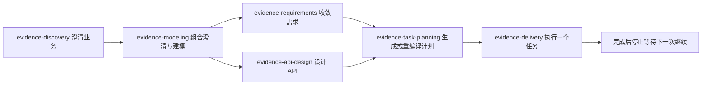
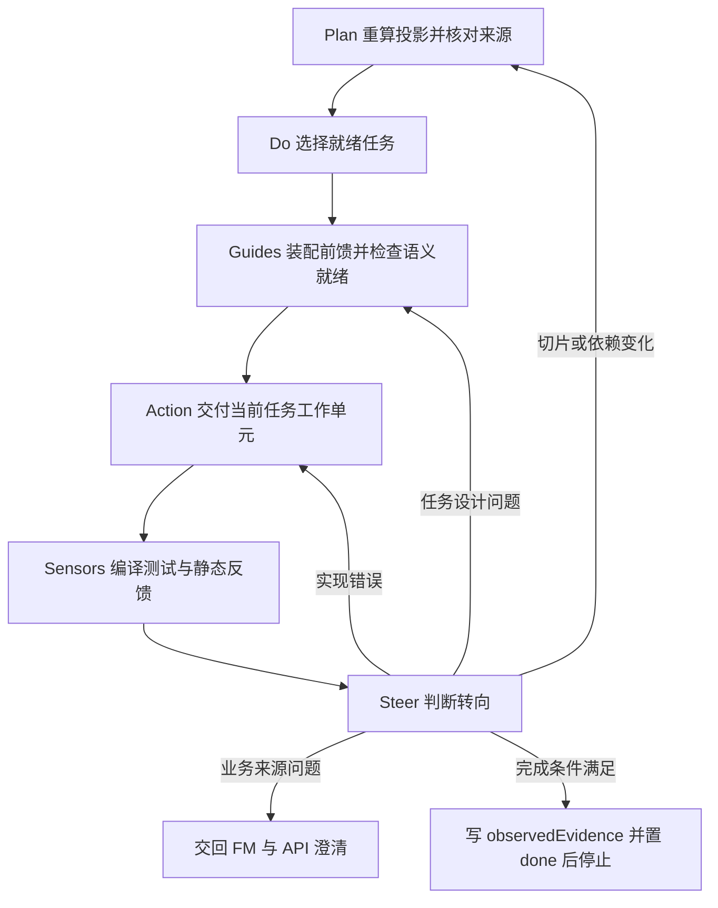
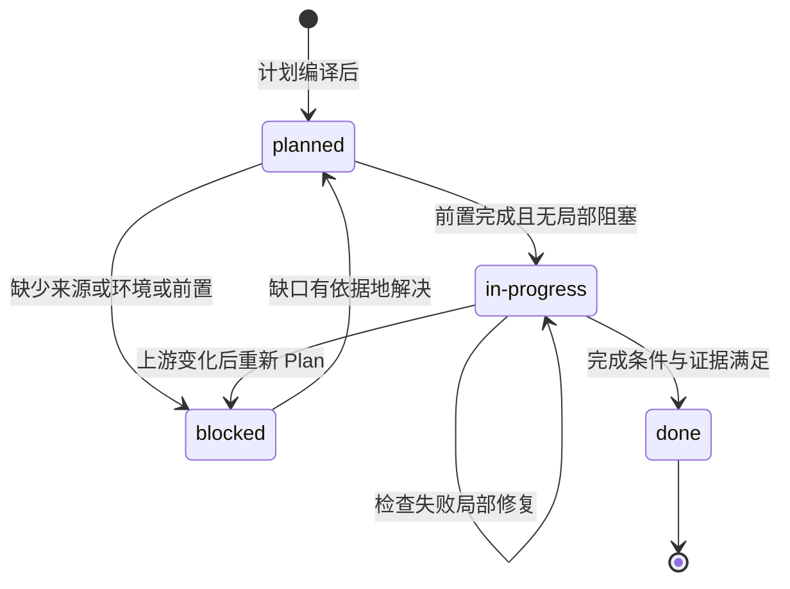

# 证据交付工作流

`evidence-delivery` 是跨系统工作流末端的执行 Skill。它消费 [evidence-task-planning](../../.agents/skills/evidence-task-planning/SKILL.md) 生成的 smart-domain 计划，把 `.evidence/fm/` 与 `.evidence/api/api.yaml` 里的业务事实交付成经过验证的软件变更，并用可重复检查证明结果。它不修改 FM/API 业务事实，不自动审批、提交 Git 或建立私有推进状态，只按授权维护 `docs/plans/smart-domain/` 下的计划状态与真实证据。

## 在跨系统工作流中的位置

完整交付链是：业务澄清 → FM 建模 → 需求收敛 → API 设计 → 任务规划 → 交付执行。每个 Skill 只拥有自己的产物与停止条件，`evidence-delivery` 位于末端，靠上一阶段的计划文件交接，不重新发现业务事实：



上图为前馈链上的 Skill 交接关系：规划消费 FM/API 与软件范围产出计划，交付只消费计划及其来源，不反向改写上游事实。

Skill 之间的握手与停止条件是：

- **建模 → 需求/API**：只有重新校验的 FM（和可选的已确认 API 设计）才能进入下游；`evidence-delivery` 不消费未收敛的发现记录直接开工。
- **规划 → 交付**：`evidence-task-planning` 产出 `docs/plans/smart-domain/index.md` 与 `docs/plans/smart-domain/tasks/*.md`，随后**停止**；`evidence-delivery` 被显式调用（按计划继续实施、查看下一任务、恢复进度、闭环执行或检查计划）时才读取这些文件。计划不存在、`compiled` 为空、源摘要过期或结构无效时，交付停在 Plan，先回到 `evidence-task-planning` 生成或重编译，不根据代码存在或聊天记忆跳到实施。
- **交付 → 上游**：FM/API 不完整时返回其拥有者处理，不在实施中改写上游事实；需求、架构、规范、howto 或代码变化使旧证据失效时显式评估重验，不用 FM/API 摘要代替全部工程来源的新鲜度判断。
- **交付自身**：每次只执行一个获授权且就绪的任务，当前任务结束后停止；下一任务需要新的明确继续动作，跨阶段也不自动推进。

## 双层循环总览

交付采用**外层 PDCA + 内层 Guides → Action → Sensors → Steer**。外层管任务生命周期（选择、依赖、进度、重规划），内层管单次交付的操控质量；两层都通过仓库文件交换状态，不依赖聊天记忆。项目宪法在 [AGENTS.md](../../AGENTS.md) 固定了这一结构，`evidence-delivery` 定义其完整协议。



上图是两层循环的控制流：内层闭环处理当前任务，转向规则把不同失败送回正确的层级；完成一轮后退出，不自动开始下一任务。

## 外层 PDCA

### Plan

1. 从项目宪法和 Guides 导航（本仓库为 [docs/guides/index.md](../../docs/guides/index.md)）进入，读取当前 FM/API、软件范围、相关架构与质量要求、计划索引和 Git 差异，确认授权与来源冲突。
2. 用 `evidence-task-planning` 的 `inventory`/`compile` 命令重算当前投影；源摘要或 `slicing` 改变时更新索引，不信任旧 `compiled`。
3. 运行只读结构检查：

```bash
python3 "$SKILL_DIR/scripts/plan_state.py" verify \
  --index "$PROJECT_ROOT/docs/plans/smart-domain/index.md"
```

结构失败先修计划；业务切片是否合理仍由 Agent 根据来源判断，机器通过不是业务批准。

### Do

只读计算当前可执行任务：

```bash
python3 "$SKILL_DIR/scripts/plan_state.py" next \
  --index "$PROJECT_ROOT/docs/plans/smart-domain/index.md"
```

从结果中选择**一个**候选任务，加载其 Guides、直接前置产物和所引用的业务/工程来源，不把完整知识库或任务图塞进上下文。`next` 只判断结构候选，不代替开工判断；通过 Guides 语义检查并开始真实实施后，才把对应 `taskNotes.status` 改为 `in-progress`。

按 `taskNotes.mode` 执行：`implementation` 普通实现与回归，`verify` 只定位和复跑已有行为，`design`/`setup`/`manual` 按任务说明执行。环境失败如实记录为阻塞，不当作业务测试结果。

### Check

先执行任务文件中每个适用 CHECK 的精确命令，再运行项目约定的质量命令，随后重新运行 `plan_state.py verify`。命令输出、退出码及必要摘要才是执行证据；文件存在、Agent 自评或旧报告不算当前通过。

### Act

- 当前实现错误：留在同一任务的内层循环修复并重跑；
- 前置、环境或来源缺失：记录稳定 gap，将任务标记 `blocked`；
- FM/API 或业务边界变化：停止当前实施，返回 Plan，更新上游和 slicing 后重编译；
- 全部完成条件及检查满足：记录 `observedEvidence`，再把任务标记 `done`；
- 当前任务结束后停止，不自动推进。

## 内层操控循环

### Guides

每次开始、恢复、纠偏或相关来源变化后，重新核对六项：授权/目标与真实文件范围；需求/验收、FM/API/规则/场景的可定位来源与审核状态；直接前置均为 `done` 且证据仍对应当前源、代码与 CHECK 环境；行为与数据拥有者、公开契约、事务入口、必要外部边界及依赖用法；`procedureRefs` 指向的真实规范/howto/范例及其适用限制；每个完成条件对应的 CHECK、预期、失败不变性与停止/转向规则。

必要项缺失不进入 Action，按权限报告或关联索引 gap，只阻塞受影响任务。结构自洽、文件存在和范例曾通过不是语义就绪或业务批准；前馈不新增状态文件，仍使用原索引/详情职责。这六项检查对应 [docs/guides/index.md](../../docs/guides/index.md) 的开工检查表，`plan_state.py` 与 `guides:verify` 都不替代它们。

### Action

只交付当前任务拥有的工作单元。跨模块通过计划中的公开契约协作，不重做共享基础，不顺带扩大接口、数据库或远程协议范围。

### Sensors

优先使用可重复的计算型反馈：编译、测试、静态分析、HTTP/SQL/事务和架构检查。语义反馈由 Agent 对照 FM 判断：实现是否忠于业务规则、切片是否仍内聚、断言是否证明预期结果。

### Steer

代码问题在当前任务修复；任务设计问题修订任务详情；切片或依赖问题回到外层 Plan；业务来源问题交回 FM 澄清。每次调整后重跑受影响检查，不用削弱场景或删除失败测试取得通过。

## 状态纪律

- 项目宪法 → 项目基线 → 工程指南 → 任务 Guides 按需加载，不保存 `guides-ready` 私有状态或重复知识副本。
- `compiled` 是计算投影，只由当前输入重新编译得到；任务身份 `taskKey = encode(concern) :: encode(ownerRef) :: encode(operationRef)`，文件名只面向人，不参与身份或执行顺序。
- `taskNotes` 是任务状态唯一位置；任务详情不复制状态或依赖图。
- `observedEvidence` 只记录真实观察，计划生成时保持为空；较长输出保存到获授权的检查目录并引用。
- 失败和未知保留在 `gaps`，只阻塞受影响任务。

## 状态生命周期

允许的任务状态只有四种：`planned`、`blocked`、`in-progress`、`done`。



上图为 `taskNotes.status` 的合法转换：依赖任务未 `done` 时当前任务不能进入 `in-progress` 或 `done`；`blocked` 必须引用已知 gap；`done` 必须有非空完成条件与真实证据。

## 转向矩阵

| 观察                       | 内层动作                      | 外层动作                                        |
| -------------------------- | ----------------------------- | ----------------------------------------------- |
| 编译、测试或静态检查失败   | 在当前文件范围修复并重跑      | 不换任务                                        |
| CHECK 不能证明 FM 预期     | 修订测试设计                  | 保持当前 taskKey；必要时重规划任务详情          |
| 任务拥有重复或缺失工作单元 | 停止实施                      | 修订 slicing 并重新 compile                     |
| FM/API 来源改变            | 停止使用旧证据                | 返回 Plan，重算投影和受影响范围                 |
| 缺少业务事实               | 不猜测实现                    | 记录 gap，交回 FM 澄清                          |
| 必要前馈不足或相互冲突     | 不进入 Action，定位来源拥有者 | 修订局部设计/关联 gap；不猜测、不建私有前馈状态 |
| 环境或命令不可用           | 记录环境阻塞                  | blocked，只影响相关任务                         |
| 当前任务全部通过           | 写入实际证据                  | 设置 done，停止等待下一次继续                   |

## 恢复会话

新会话按最小顺序恢复：读项目宪法、Guides 导航和 Git 差异，确认合法模式与授权范围 → 核对当前 FM/API 与计划输入，必要时回到 Plan 重编译 → 运行 `plan_state.py verify` 再读 `next` 的结构候选 → 选择一个任务并读其 Guides、局部设计与 CHECK → 加载直接前置证据、`sourceRefs` 与 `procedureRefs` 对应的实际来源 → 完成六项开工检查 → 确认工作树与任务状态一致后，通过才开始本任务。架构/指南/代码/环境变化须评估重验，不能只依赖业务源摘要；索引不存在或结构无效时停止在 Plan。

## 配置与运维

| 目的             | 命令                                                                                                         |
| ---------------- | ------------------------------------------------------------------------------------------------------------ |
| 只读校验计划结构 | `python3 "$SKILL_DIR/scripts/plan_state.py" verify --index "$PROJECT_ROOT/docs/plans/smart-domain/index.md"` |
| 只读计算候选任务 | `python3 "$SKILL_DIR/scripts/plan_state.py" next --index "$PROJECT_ROOT/docs/plans/smart-domain/index.md"`   |
| 重新编译计划投影 | `evidence-task-planning` 的 `inventory` / `compile --fm ... [--api ...] --mapping ...`                       |
| 前馈文档结构验证 | `npm run guides:verify`                                                                                      |
| 交付 Skill 回归  | `python3 -B -m unittest discover -s .agents/skills/evidence-delivery/tests -v`                               |

`plan_state.py` 只读，不替 Agent 修改状态；状态写入必须是本轮获授权工作的直接结果。`sourceFreshness` 始终报告 `not-checked`，提醒执行者先重编译 FM/API 输入，不把旧投影当作当前证据。

## 不变量与失败语义

- **编辑授权 ≠ 业务批准**：机器结构通过、文件写入和命令成功不能替代业务批准；任务不设第二份前馈状态，不自动审批或提交 Git。
- **每次只执行一个获授权且就绪的任务**，完成后停止；缺口只阻塞受影响任务，不通过改上游、删测试或扩范围制造通过。
- **环境失败与业务失败分开**：环境不可用记为环境阻塞，不伪装成业务测试结果；缓存命中、历史结果与本次执行分别说明。
- **证据新鲜度**：FM/API 摘要不覆盖工程指南；规范、架构、howto、代码或 CHECK 环境变化会使旧证据失效，须显式评估重验范围。

## 聚焦测试

- [test_plan_state.py](../../.agents/skills/evidence-delivery/tests/test_plan_state.py)：断言 `inspect_plan`/`next` 只读（检查前后文件字节不变）、首个 planned 任务可运行、done 依赖使下一任务可运行、五种 mode 合法、active 任务要求依赖完成、blocked/空命令必须引用 gap、taskNotes/详情/CHECK id 一一对应、done 需要完成条件与证据、executionOrder 符合依赖、CLI 输出 JSON 且无效计划返回非零。
- [test_guides_contract.py](../../.agents/skills/evidence-delivery/tests/test_guides_contract.py)：回归 Guides 门位于 Action 之前、保留单一 `taskNotes` 状态、FM/API 摘要不覆盖工程指南、`next` 只判断结构候选、恢复会话先重载工程来源并在 Action 前核对 `procedureRefs`。

这些自动回归验证实现与协议文本，不调用语言模型，也不证明某个具体任务的业务语义已获批。

## 相关页面

- [Evidence Harness 系统](../architecture/harness.md)：四类 Harness 组件的装配关系与 Skill 调用方向。
- [权威来源与前馈](../concepts/evidence-sources.md)：`taskNotes`/`observedEvidence` 背后的单一职责来源模型。
- [验证关卡](../operations/verification.md)：任务 CHECK 与仓库根质量门的覆盖及证据纪律。
- [Harness 与 Skill 测试](../testing/harness-tests.md)：交付 Skill 套件的维护与回归边界。
- [FM 到实现映射](../concepts/domain-mapping.md)：代码/HTTP/SQL 名称是映射结果，不是新的业务身份。
